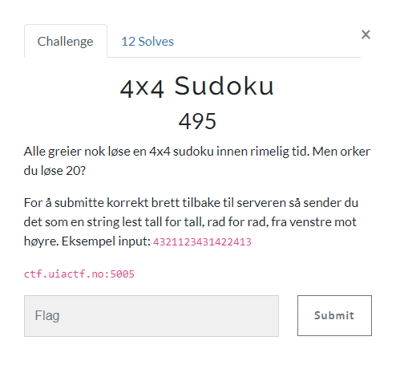

# 4x4 Sudoku

> 4x4 Sudoku
>
> Alle greier nok løse en 4x4 sudoku innen rimelig tid. Men orker du løse 20?
>
> For å submitte korrekt brett tilbake til serveren så sender du det som en string lest tall for tall, rad for rad, fra venstre mot høyre. Eksempel input: 4321123431422413
>
> ctf.uiactf.no:5005



---

When we connect to the server we get the following:

```bash
$ nc ctf.uiactf.no 5005
Løs dette:
[1,0,0,3]
[0,2,4,0]
[0,0,0,2]
[2,1,0,4]
```

So we need to solve Sudoku puzzles. I'm not writing the Sudoku solver myself here, I'll be using `https://pypi.org/project/py-sudoku/`.

This is the script I came up with:

`solve.py`
```python
from array import array
from sudoku import Sudoku
from pwn import *

io = connect("ctf.uiactf.no", 5005)

# Puzzles solved so far
count = 0

# Solve 20 puzzles
while (count < 20):
    count = count + 1

    # Wait for the start of the next puzzle
    rec = io.recvuntil(b'[')
    
    # Read every line of the puzzle,
    # every line looks something like this: [0,0,4,2]
    line1 = io.recvline(False).decode()
    line2 = io.recvline(False).decode()
    line3 = io.recvline(False).decode()
    line4 = io.recvline(False).decode()

    # Python way of parsing array strings into int arrays,
    # when the developer doesn't know Python
    b1 = [int(i) for i in line1.replace('[', '').replace(']', '').split(',')]
    b2 = [int(i) for i in line2.replace('[', '').replace(']', '').split(',')]
    b3 = [int(i) for i in line3.replace('[', '').replace(']', '').split(',')]
    b4 = [int(i) for i in line4.replace('[', '').replace(']', '').split(',')]
    b = [b1, b2, b3, b4]
    print(b)

    puzzle = Sudoku(2, 2, board=b)
    #print(puzzle)
    solution = str(puzzle.solve().board).replace(',', '').replace('[', '').replace(']', '').replace(' ', '')

    # Send solution
    print("Løsning: " + solution)
    io.sendline(solution.encode())

# Finished solving all 20 puzzles
print(io.recvuntil(b"Flag: ").decode())
print(io.recvline().decode())
```


```bash
$ python3 solve.py 
[+] Opening connection to ctf.uiactf.no on port 5005: Done
[[0, 0, 0, 3], [1, 3, 2, 4], [3, 0, 4, 0], [0, 1, 0, 0]]
Løsning: 2413132432414132
[[1, 0, 0, 0], [3, 0, 0, 4], [0, 3, 0, 1], [2, 1, 0, 3]]
Løsning: 1432321443212143
[[0, 1, 4, 0], [4, 0, 0, 0], [0, 4, 2, 3], [0, 3, 0, 4]]
Løsning: 3142423114232314
[[1, 0, 2, 0], [0, 0, 3, 0], [2, 0, 0, 3], [3, 4, 0, 2]]
Løsning: 1324423121433412
[[2, 1, 0, 0], [0, 0, 0, 0], [4, 2, 3, 1], [0, 3, 2, 0]]
Løsning: 2143341242311324
[[4, 3, 0, 0], [2, 0, 4, 3], [1, 4, 0, 2], [0, 0, 0, 0]]
Løsning: 4321214314323214
[[0, 0, 0, 1], [0, 0, 3, 0], [0, 2, 0, 3], [1, 3, 4, 2]]
Løsning: 3421213442131342
[[0, 3, 0, 1], [1, 0, 3, 4], [3, 0, 0, 0], [0, 4, 0, 3]]
Løsning: 4321123431422413
[[3, 1, 0, 0], [0, 0, 1, 0], [1, 2, 3, 4], [0, 0, 2, 0]]
Løsning: 3142241312344321
[[4, 0, 2, 0], [0, 0, 0, 3], [0, 4, 0, 0], [3, 2, 1, 4]]
Løsning: 4321214314323214
[[1, 2, 0, 0], [0, 4, 1, 2], [4, 0, 0, 0], [0, 0, 4, 1]]
Løsning: 1234341241232341
[[2, 0, 0, 4], [4, 1, 0, 0], [3, 0, 0, 1], [0, 2, 0, 3]]
Løsning: 2314413234211243
[[0, 0, 4, 0], [2, 4, 3, 0], [3, 0, 0, 0], [4, 0, 2, 3]]
Løsning: 1342243132144123
[[0, 1, 0, 0], [0, 4, 0, 3], [1, 2, 0, 4], [4, 3, 0, 0]]
Løsning: 3142241312344321
[[0, 3, 0, 0], [4, 2, 0, 3], [0, 4, 0, 0], [0, 1, 3, 4]]
Løsning: 1342421334212134
[[3, 0, 0, 2], [4, 0, 3, 1], [2, 0, 0, 4], [0, 0, 0, 3]]
Løsning: 3142423123141423
[[4, 0, 0, 2], [0, 0, 3, 4], [0, 0, 0, 3], [3, 0, 4, 1]]
Løsning: 4312213414233241
[[2, 3, 0, 0], [1, 4, 0, 3], [0, 1, 4, 0], [0, 0, 0, 1]]
Løsning: 2314142331424231
[[1, 0, 4, 0], [4, 0, 0, 3], [3, 4, 0, 1], [0, 1, 0, 0]]
Løsning: 1342421334212134
[[1, 0, 0, 0], [2, 3, 1, 0], [4, 0, 3, 1], [0, 0, 4, 0]]
Løsning: 1423231442313142
Korrekt!
Flag: 
UIACTF{løser_soduku_som_om_dette_var_på_barneskolen}

[*] Closed connection to ctf.uiactf.no port 5005
```

We got the flag! 🚩

## Flag

`UIACTF{løser_soduku_som_om_dette_var_på_barneskolen}`
