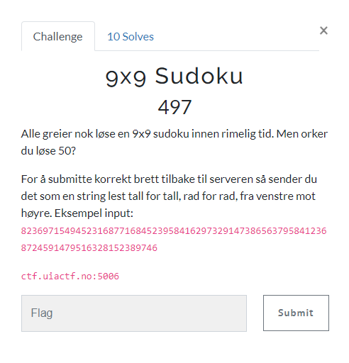

# 9x9 Sudoku

> 9x9 Sudoku
> 497
> Alle greier nok løse en 9x9 sudoku innen rimelig tid. Men orker du løse 50?
>
> For å submitte korrekt brett tilbake til serveren så sender du det som en string lest tall for tall, rad for rad, fra venstre mot høyre.
>
> Eksempel input: `823697154945231687716845239584162973291473865637958412368724591479516328152389746`
>
> ctf.uiactf.no:5006



---

Denne oppgaven bør kunne løses på samme måte som jeg løste `4x4 Sudoku`. Se gjerne på tidligere writeup for mer detaljer.

Vi blir møtt med følgende når vi kobler til servere:

```bash
$ nc ctf.uiactf.no 5006
Løs dette:
[2,0,4,3,0,0,1,0,7]
[0,0,0,0,1,0,0,0,8]
[0,1,0,0,0,0,0,9,3]
[0,6,8,5,7,0,0,0,0]
[1,0,2,0,0,0,7,0,0]
[0,0,0,0,4,0,0,0,0]
[8,0,1,0,0,5,6,0,2]
[7,2,0,0,0,4,9,0,5]
[5,0,0,7,0,2,0,0,4]
```

Vi må altså tilpasse `solve.py` fra `4x4 Sudoku` til å fungere med `9x9 Sudoku`.

Vi fortsetter å bruke `https://pypi.org/project/py-sudoku/`, da dette biblioteket har støtte for forskjellige brettstørrelser.

Tilpasset `solve.py` skript:

```python
from array import array
from sudoku import Sudoku
from pwn import *

io = connect("ctf.uiactf.no", 5006)

# Puzzles solved so far
count = 0

# Solve 50 puzzles
while (count < 50):
    count = count + 1

    # Wait for the start of the next puzzle
    rec = io.recvuntil(b'[')
    
    # Read every line of the puzzle,
    # every line looks something like this: [0,0,4,2]
    line1 = io.recvline(False).decode()
    line2 = io.recvline(False).decode()
    line3 = io.recvline(False).decode()
    line4 = io.recvline(False).decode()
    line5 = io.recvline(False).decode()
    line6 = io.recvline(False).decode()
    line7 = io.recvline(False).decode()
    line8 = io.recvline(False).decode()
    line9 = io.recvline(False).decode()

    # Python way of parsing array strings into int arrays,
    # when the developer doesn't know Python
    b1 = [int(i) for i in line1.replace('[', '').replace(']', '').split(',')]
    b2 = [int(i) for i in line2.replace('[', '').replace(']', '').split(',')]
    b3 = [int(i) for i in line3.replace('[', '').replace(']', '').split(',')]
    b4 = [int(i) for i in line4.replace('[', '').replace(']', '').split(',')]
    b5 = [int(i) for i in line5.replace('[', '').replace(']', '').split(',')]
    b6 = [int(i) for i in line6.replace('[', '').replace(']', '').split(',')]
    b7 = [int(i) for i in line7.replace('[', '').replace(']', '').split(',')]
    b8 = [int(i) for i in line8.replace('[', '').replace(']', '').split(',')]
    b9 = [int(i) for i in line9.replace('[', '').replace(']', '').split(',')]
    b = [b1, b2, b3, b4, b5, b6, b7, b8, b9]
    print(b)

    puzzle = Sudoku(3, 3, board=b)
    print(puzzle)

    solution = str(puzzle.solve().board).replace(',', '').replace('[', '').replace(']', '').replace(' ', '')

    # Send solution
    print("Løsning: " + solution)
    io.sendline(solution.encode())

# Finished solving all 50 puzzles
print(io.recvuntil(b"Flag: ").decode())
print(io.recvline().decode())
```

La oss kjøre skriptet:

```bash
$ python solve.py
#...abbreviated
[[0, 5, 1, 0, 7, 0, 0, 8, 2], [0, 8, 0, 0, 0, 0, 5, 0, 0], [0, 0, 0, 8, 5, 0, 0, 0, 3], [4, 0, 6, 0, 0, 8, 0, 0, 0], [8, 2, 0, 0, 4, 3, 6, 0, 1], [0, 1, 0, 0, 0, 0, 0, 0, 0], [0, 6, 0, 2, 0, 0, 0, 4, 0], [0, 4, 0, 3, 1, 0, 8, 0, 6], [0, 0, 0, 7, 0, 0, 0, 5, 9]]

---------------------------
9x9 (3x3) SUDOKU PUZZLE
Difficulty: 0.62
---------------------------
+-------+-------+-------+
|   5 1 |   7   |   8 2 |
|   8   |       | 5     |
|       | 8 5   |     3 |
+-------+-------+-------+
| 4   6 |     8 |       |
| 8 2   |   4 3 | 6   1 |
|   1   |       |       |
+-------+-------+-------+
|   6   | 2     |   4   |
|   4   | 3 1   | 8   6 |
|       | 7     |   5 9 |
+-------+-------+-------+

        
Løsning: 351476982782931564694852713476198235829543671513627498165289347947315826238764159
Korrekt!
Flag: 
UIACTF{hekta_på_sudoku_som_om_det_var_2004}

[*] Closed connection to ctf.uiactf.no port 5006
```

Flagget er vårt! 🚩

## Flag

`UIACTF{hekta_på_sudoku_som_om_det_var_2004}`
