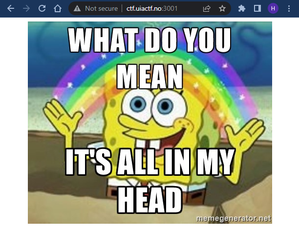

> Bare i mitt hode
>
> Hva finnes i hodet mitt?
> 
> ctf.uiactf.no:3001



## `headers.jpg`

```bash
$ file bare-i-mitt-hode/headers.jpg
bare-i-mitt-hode/headers.jpg: JPEG image data, baseline, precision 8, 500x414, components 3
```

Trodde dette skulle være en slags stego-oppgave først.

Sjekket litt med: https://stegonline.georgeom.net/image, men fant ingenting spesielt.

Etter litt nærmere tenking rundt "HEAD" så slo det meg selvfølgelig at det kunne være `HTTP`-relatert.

Sjekket først headers i Chrome Dev-tools før jeg sjekket med en `HEAD`-request.

```bash
$ curl --head HEAD http://ctf.uiactf.no:3001/
curl: (6) Could not resolve host: HEAD
HTTP/1.1 200 OK
Date: Mon, 24 Oct 2022 14:07:33 GMT
Server: Apache/2.4.38 (Debian)
X-Powered-By: PHP/8.1.12RC1
flag: uiactf{voldsomt-lite-hode}
Content-Type: text/html; charset=UTF-8
```

## Flag

`flag: uiactf{voldsomt-lite-hode}`
