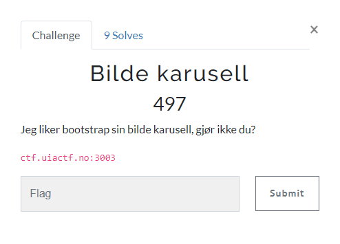
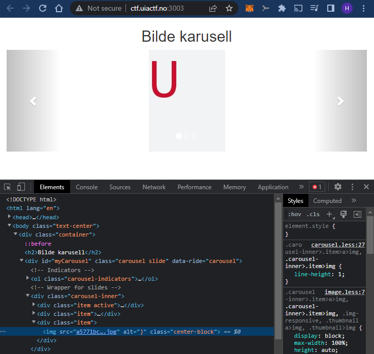
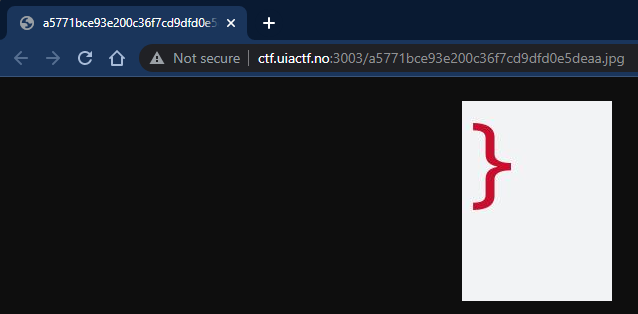
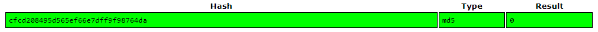
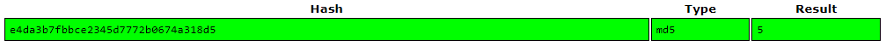
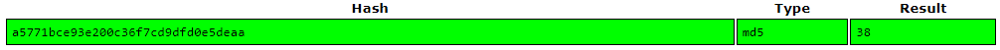
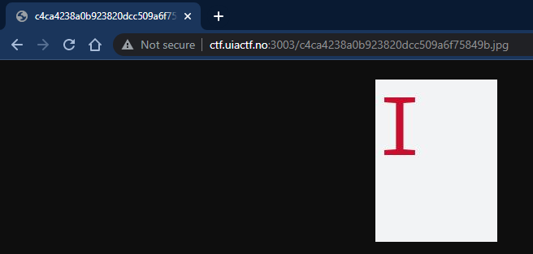
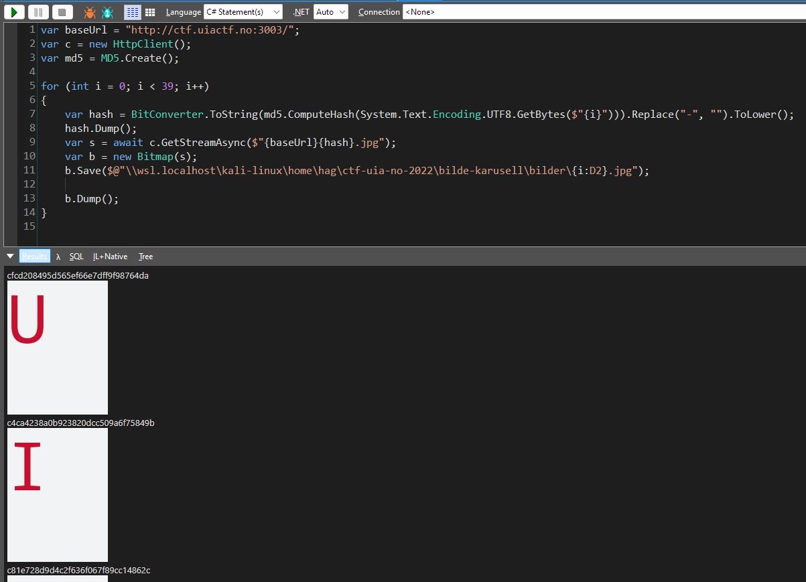
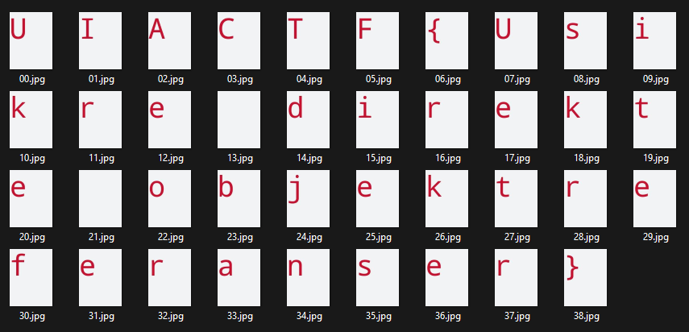

# Bilde karusell

> Bilde karusell
>
> Jeg liker bootstrap sin bilde karusell, gjør ikke du?
> 
> ctf.uiactf.no:3003



---

På nettsiden ser vi følgende:



Dette er en bildekarusell med 3 bilder. Bildene viser en `U`, en `F` og en `}`. Dette er nok deler av flagget.

I kildekoden ser vi referansene til de 3 bildene.

```html
    <!-- Wrapper for slides -->
    <div class="carousel-inner">
      <div class="item active">
        
      </div>

      <div class="item">
        
      </div>
    
      <div class="item">
        
      </div>
    </div>
```

Vi må finne resten av bildene for å finne resten av flagget.



Vi ser at bildene ikke ligger i en undermappe på domenet, så vi er ikke så heldige at det er en usikret directory listing tilgjengelig...

Neste steg er å ta en nærmere titt på filnavnet for hvert bilde:

```
cfcd208495d565ef66e7dff9f98764da.jpg
e4da3b7fbbce2345d7772b0674a318d5.jpg
a5771bce93e200c36f7cd9dfd0e5deaa.jpg
```

Dette ser ut som en hash av et eller annet slag. Jeg tipper `MD5`. La oss sjekke hashene på `https://crackstation.net/`:





Det var akkurat som jeg håpet! Hashene er `MD5` hasher og de er generert fra en løpende teller. Det betyr at vi enkelt kan generere de resterende hashene og laste ned de resterende delene av flagget.

Vi kan gjøre en sanity check på fremgangsmåten vår før vi fortsetter:

```bash
$ echo -n "0" | md5sum
cfcd208495d565ef66e7dff9f98764da  -
```

Ser bra ut, hashen for `0` matcher hashen for `U`-bildet ovenfor.

La oss kalkulere `MD5`-hashen av `1` og se om vi finner `I`-bildet:
```bash
$ echo -n "1" | md5sum
c4ca4238a0b923820dcc509a6f75849b  -
```



Dette ser veldig lovende ut. La oss automatisere nedlasting av de resterende bildene.

Denne gangen skriver jeg et skript i `C#`. `LINQPad` er perfekt til formålet:



Skriptet i tekstform:

```csharp
var baseUrl = "http://ctf.uiactf.no:3003/";
var c = new HttpClient();
var md5 = MD5.Create();

for (int i = 0; i < 39; i++)
{
	var hash = BitConverter.ToString(md5.ComputeHash(System.Text.Encoding.UTF8.GetBytes($"{i}"))).Replace("-", "").ToLower();
	hash.Dump();
	var s = await c.GetStreamAsync($"{baseUrl}{hash}.jpg");
	var b = new Bitmap(s);
	b.Save($@"\\wsl.localhost\kali-linux\home\hag\ctf-uia-no-2022\bilde-karusell\bilder\{i:D2}.jpg");
	
	b.Dump();
}
```

Dette skriptet itererer gjennom id 0 til 38 og `MD5`-hashene kalkuleres. Deretter lastes bildene ned til et bildeobjekt og lagres på harddisken i tillegg til å vises i `LINQPad` ved hjelp av `Dump()`.

Når vi åpner mappen med alle bildene er det ganske enkelt å lese ut hele flagget:




## Flag
`UIACTF{Usikre direkte objektreferanser}`
