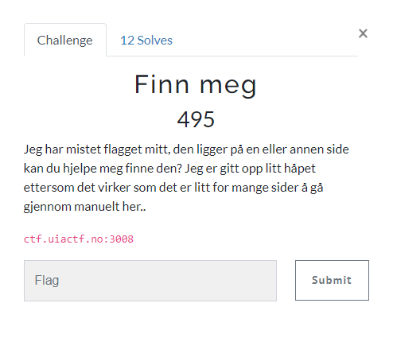
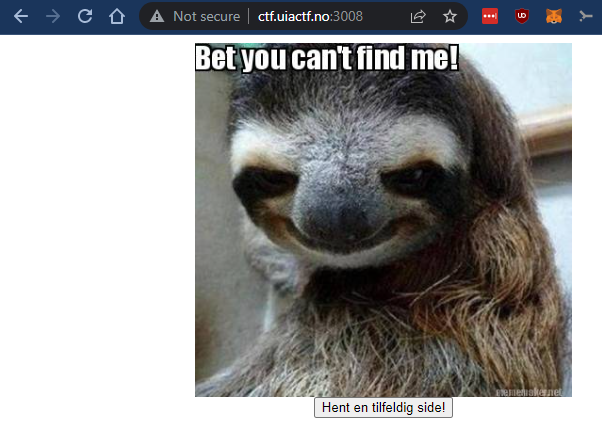
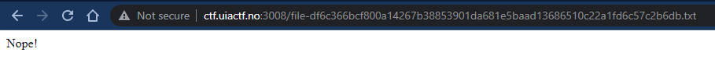
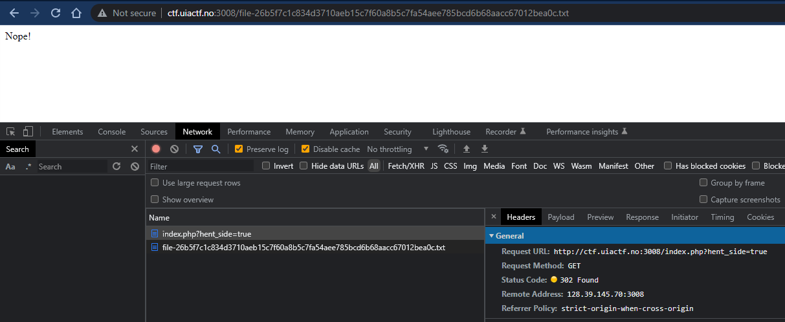
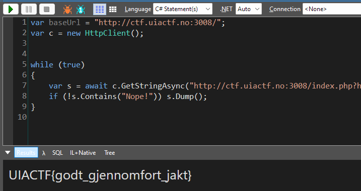

# Finn meg

> Finn meg
>
> Jeg har mistet flagget mitt, den ligger på en eller annen side kan du hjelpe meg finne den? Jeg er gitt opp litt håpet ettersom det virker som det er litt for mange sider å gå gjennom manuelt her..
>
> ctf.uiactf.no:3008



---

Nettsiden:



`Hent en tilfeldig side!` tar hos her:



Her begynte jeg å tenke litt tilbake til `Bilde karusell`-oppgaven og begynte å se litt på generering av SHA-256 hasher osv., men skjønte heldigvis relativt raskt at det ikke var veien å gå.

Vi ser litt nærmere på hva som skjer når vi trykker på `Hent en tilfeldig side!`-knappen:



Knappen tar oss til `http://ctf.uiactf.no:3008/index.php?hent_side=true` som omdirigerer oss videre til en tilfeldig side.

Kanskje vi bare må laste en tilfeldig side nok ganger for å finne riktig side?

Jeg lagde dette skriptet for å hente en ny side helt til vi finner en side som **IKKE** inneholder strengen `Nope!`:

`solve.cs`
```csharp
var c = new HttpClient();

while (true)
{
	var s = await c.GetStringAsync("http://ctf.uiactf.no:3008/index.php?hent_side=true");
	if (!s.Contains("Nope!")) s.Dump();
}
```

Det fungerte veldig bra!



## Flagg

`UIACTF{godt_gjennomfort_jakt}`


***I Bet I Can***