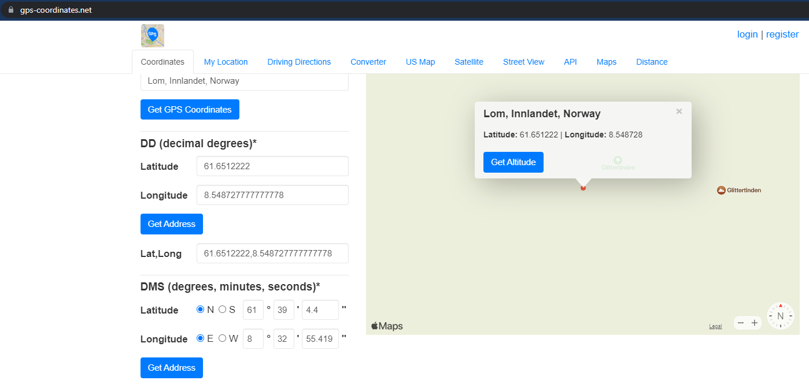

> Hvor i verden
> 
> Jeg har vært på litt for mange toppturer i det siste og har helt glemt hvor enkelte bilder kommer fra.
> 
> Kan du hjelpe meg finne ut hvor jeg var på vei når jeg tok dette bildet?
> 
> Flag: UIACTF{stedet}
> 
> File: `glemt_lokasjon.jpeg`


```bash
$ file /mnt/c/Users/hag/Downloads/glemt_lokasjon.jpeg
/mnt/c/Users/hag/Downloads/glemt_lokasjon.jpeg: JPEG image data, JFIF standard 1.01, aspect ratio, density 1x1, segment length 16, Exif Standard: [TIFF image data, little-endian, direntries=2, software=Google, GPS-Data], baseline, precision 8, 207x99, components 3
```

```bash
$ exiftool /mnt/c/Users/hag/Downloads/glemt_lokasjon.jpeg
ExifTool Version Number         : 12.39
File Name                       : glemt_lokasjon.jpeg
Directory                       : /mnt/c/Users/hag/Downloads
File Size                       : 13 KiB
File Modification Date/Time     : 2022:10:24 15:45:46+02:00
File Access Date/Time           : 2022:10:24 15:45:50+02:00
File Inode Change Date/Time     : 2022:10:24 15:45:50+02:00
File Permissions                : -rwxrwxrwx
File Type                       : JPEG
File Type Extension             : jpg
MIME Type                       : image/jpeg
JFIF Version                    : 1.01
Resolution Unit                 : None
X Resolution                    : 1
Y Resolution                    : 1
Exif Byte Order                 : Little-endian (Intel, II)
Software                        : Google
GPS Version ID                  : 2.3.0.0
GPS Latitude Ref                : North
GPS Longitude Ref               : East
Image Width                     : 207
Image Height                    : 99
Encoding Process                : Baseline DCT, Huffman coding
Bits Per Sample                 : 8
Color Components                : 3
Y Cb Cr Sub Sampling            : YCbCr4:4:4 (1 1)
Image Size                      : 207x99
Megapixels                      : 0.020
GPS Latitude                    : 61 deg 39' 4.40" N
GPS Longitude                   : 8 deg 32' 55.42" E
GPS Position                    : 61 deg 39' 4.40" N, 8 deg 32' 55.42" E
```

### https://www.gps-coordinates.net/




## Flag

`UIACTF{glittertind}`