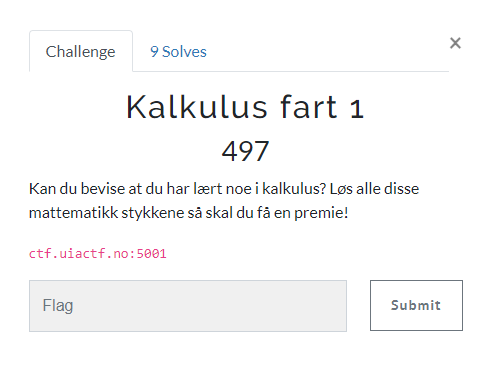
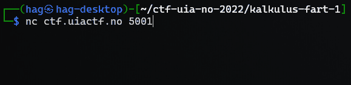

# Kalkulus fart 1

>Kalkulus fart 1
>
>Kan du bevise at du har lært noe i kalkulus? Løs alle disse mattematikk stykkene så skal du få en premie!
>
>ctf.uiactf.no:5001



---

Når vi kobler til serveren blir vi møtt med følgende melding:

```bash
$ nc ctf.uiactf.no 5001
Kan du hjelpe meg løse disse 'få' tusen mattestykkene?:
861 + 761 = ?
1622
705 + 373 = ?
```

Her må vi altså løse "tusenvis" av regnestykker! Her må vi ty til kode for å løse alle regnestykkene automatisk for oss.



Ganske irriterende at den første linjen er så treg, da blir det litt mer ventetid når vi skal teste...

Python er ikke min sterkeste side så her hadde jeg nok spart litt tid på å teste ut selve parsingen uten å koble til serveren hver gang... 🤦🏻‍♂️

Jeg endet opp med å teste litt i kommandolinjen etterhvert, men skulle gjort det fra starten av:

```bash
$ python
Python 3.10.5

>>> "174 + 531 = ?".split('+')
['174 ', ' 531 = ?']
>>> "174 + 531 = ?".split('=')
['174 + 531 ', ' ?']
>>> "174 + 531 = ?".split('=')[0].split('+')
['174 ', ' 531 ']
>>> "174 + 531 = ?".split('=')[0].split('+')
['174 ', ' 531 ']
>>> exit()
```

Jeg endet opp med dette skriptet:

`solve.py`
```python
from pwn import *

io = connect("ctf.uiactf.no", 5001)

print(io.recvline().decode())

while (True):
    exp = io.recvline(False).decode()
    print(exp)
    if (exp.find('+') > -1):
        parts = exp.split('=')
        parts = parts[0].split('+')
        answer = f"{int(parts[0]) + int(parts[1])}"
        print(answer)
        io.sendline(answer.encode())
    else:
        io.interactive()
```

Jeg regnet først med at det skulle være flere type oppgaver, men det var faktisk bare addisjon. Greit for meg:

```bash
$ python solve.py
[+] Opening connection to ctf.uiactf.no on port 5001: Done
Kan du hjelpe meg løse disse 'få' tusen mattestykkene?:
926 + 806 = ? 
1732
# abbreviated...
932 + 16 = ? 
948
For en fart!
[*] Switching to interactive mode
UIACTF{speedy_gonzales_numero_uno}[*] Got EOF while reading in interactive
$
```

Etter at skriptet har kjørt en del sekunder blir vi presentert med flagget! 🚩

## Flag

`UIACTF{speedy_gonzales_numero_uno}`
