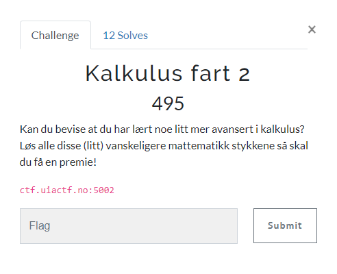

# Kalkulus fart 2

> Kalkulus fart 2
>
> Kan du bevise at du har lært noe litt mer avansert i kalkulus? Løs alle disse (litt) vanskeligere mattematikk stykkene så skal du få en premie!
>
> ctf.uiactf.no:5002



Når vi kobler til serveren blir vi møtt med følgende melding:

```bash
$ nc ctf.uiactf.no 5002
Kan du hjelpe meg løse disse 'få' tusen mattestykkene?:
503-46*300-504+871*783*747*121 = ?
61643287490
315*558-586*573+224-826-783+1014+519*17-712*288*993 = ?
-203772164
381 = ?
381
734*556 = ?
```

Litt mer kompliserte oppgaver enn i `Kalkulus fart 1` her altså. Her tyr vi rett og slett til `eval` for å enklere løse de matematiske uttrykkene. Her tenkte jeg faktisk litt frem og prøvde meg på `regex` for å hviteliste hva som er tillatt i uttrykkene.

Oppdatert `solve.py` skript:

```python
from pwn import *
import re

io = connect("ctf.uiactf.no", 5002)

print(io.recvline().decode())

while (True):
    exp = io.recvline(False).decode()
    
    if (exp.find('=') > -1):
        exp = exp.replace('=', '').replace('?', '')
        if (re.match("[0-9\+\-\*\/].*", exp) != None):
            print(exp)
            answer = eval(exp)
            print(answer)
            io.sendline(f"{answer}")
        else:
            print("Contains illegal chars! exp: " + exp)
    else:
        io.interactive()
```

Jeg regnet faktisk med at det skulle være en `eval`-felle i denne oppgaven, så ble litt lei meg når jeg så følgende:

```bash
$ python solve.py
# ...abbreviated
341
92+463-866*194   
-167449
106+591*701+796-593+875-841*169+524+566   
274436
[*] Switching to interactive mode
UIACTF{flott_at_du_stoler_paa_all_input}
[*] Got EOF while reading in interactive
$
```

Etter at skriptet har kjørt en del sekunder blir vi presentert med flagget! 🚩

## Flag

`UIACTF{flott_at_du_stoler_paa_all_input}`

> *Tja, tenkte hvertfall på å gjøre en innsats ved å hviteliste ;)*
