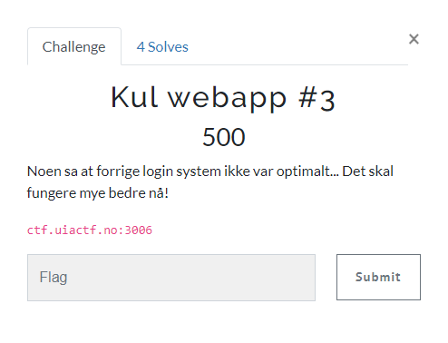
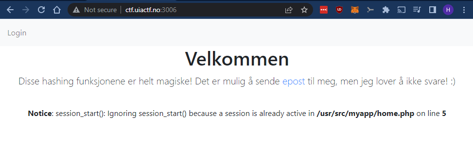
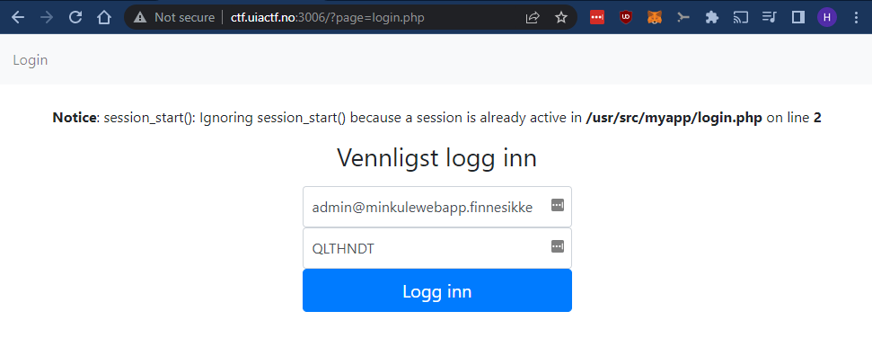
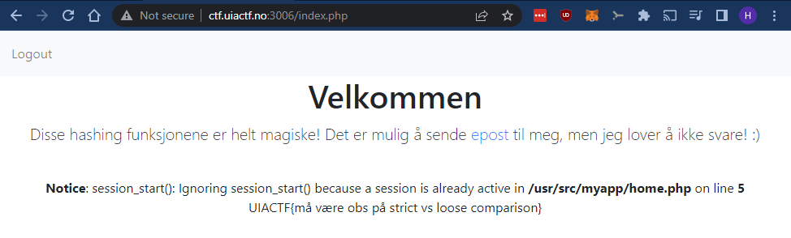

# Kul webapp #3

> Kul webapp #3
>
> Noen sa at forrige login system ikke var optimalt... Det skal fungere mye bedre nå!
>
> ctf.uiactf.no:3006



---

Nettsiden:



> Disse hashing funksjonene er helt magiske! Det er mulig å sende epost til meg, men jeg lover å ikke svare! :)

Her hintes det til at passord-`hashing` har blitt implementert. Det fikk meg til å tenkte på `magic hashes`.

Dette er `hasher` som starter med `0e` og hvor resten av hashen inneholder kun `[0-9]` (ikke `[a-f]`). I `PHP` kan dette føre til en feil i sammenligningen av to hasher dersom man bruker `==`-operatoren for sammenligning istedet for `===`-operatoren.

Eksempel på sårbar kode:

```php
<?php
    if('0e519231' == '0e958123') {
        print ("True\n");
    }else {
        print ("False\n");
    }
?>

// Result: True
```

Liste over magic hashes: https://github.com/spaze/hashes/blob/master/md5.md

La oss ta utgangspunkt i følgende hasher:

- `QLTHNDT:0e405967825401955372549139051580`
- `JH4cGnwKzd0y:0e545428394516071575146741684795`

Strengen `QLTHNDT` tilsvarer `MD5`-hashen `0e405967825401955372549139051580` og strengen `JH4cGnwKzd0y` tilsvarer `MD5`-hashen `0e545428394516071575146741684795`.

La oss si at passordet til `admin@minkulewebapp.finnesikke` er `JH4cGnwKzd0y`, som er et ganske bra passord, men hvor hashen altså er en magic hash. Da vil vi kunne bruke hvilket som helst annet passord som også har en magic hash. F.eks.: `QLTHNDT`.

Eksempel:

```php
php > echo (hash('md5', 'QLTHNDT', false) == hash('md5', 'JH4cGnwKzd0y', false)) ? "TRUE" : "FALSE";
// Resultat:
TRUE
```

La oss prøve `QLTHNDT` som passord:



Vi ble logget inn! Når vi laster `http://ctf.uiactf.no:3006/index.php` igjen ser vi følgende:



## Flagg

`UIACTF{må være obs på strict vs loose comparison}`
