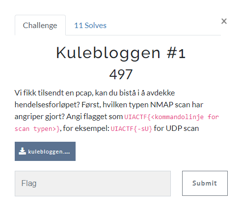
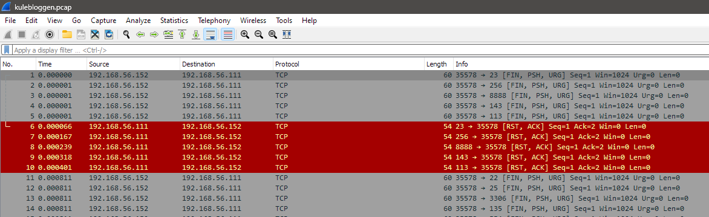

# Kulebloggen #1

> Kulebloggen #1
>
> Vi fikk tilsendt en pcap, kan du bistå i å avdekke hendelsesforløpet? Først, hvilken typen NMAP scan har angriper gjort? Angi flagget som UIACTF{<kommandolinje for scan typen>}, for eksempel: UIACTF{-sU} for UDP scan
>
> File: `kulebloggen.pcap`

---

Vi åpner `kulebloggen.pcap` i Wireshark:

Vi ser at det er gjort en port scan mot `192.168.56.111`. Vi skal finne ut hvilken scan som er gjort.

Skanneteknikkene i `nmap` er beskrevet her: https://nmap.org/book/man-port-scanning-techniques.html

> Xmas scan (-sX)
> 
> Sets the FIN, PSH, and URG flags, lighting the packet up like a Christmas tree.

Vi ser at `Xmas scan (-sX)` matcher med flaggene TCP-flaggene som er satt i pakkene i Wireshark.

## Flagg

Flagget blir da:

`UIACTF{-sX}`
