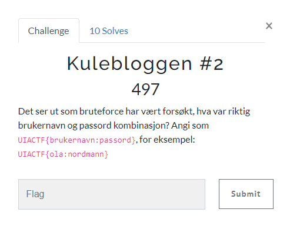
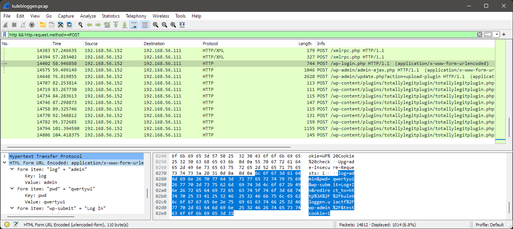

# Kulebloggen #2

> Kulebloggen #2
>
> Det ser ut som bruteforce har vært forsøkt, hva var riktig brukernavn og passord kombinasjon?
>
> Angi som UIACTF{brukernavn:passord}, for eksempel: UIACTF{ola:nordmann}




---

Vi bruker filteret; `http && http.request.method==POST` for å se etter påloggingsforsøk:



Vi ser at det er en request til `/wp-login.php` hvor det umiddelbart gjøres en request til `/wp-admin` etterpå. Det betyr at påloggingsforsøket i forrige request etter all sansynlighet var vellykket.

Når vi ser på innholdet i pakken finner vi requesten som inneholder brukernavnet og passordet som ble brukt:

```
POST /wp-login.php HTTP/1.1
Host: kulebloggen.uiactf
User-Agent: Mozilla/5.0 (X11; Linux x86_64; rv:102.0) Gecko/20100101 Firefox/102.0
Accept: text/html,application/xhtml+xml,application/xml;q=0.9,image/avif,image/webp,*/*;q=0.8
Accept-Language: en-US,en;q=0.5
Accept-Encoding: gzip, deflate
Referer: http://kulebloggen.uiactf/wp-login.php
Content-Type: application/x-www-form-urlencoded
Content-Length: 110
Origin: http://kulebloggen.uiactf
DNT: 1
Connection: keep-alive
Cookie: wordpress_test_cookie=WP%20Cookie%20check
Upgrade-Insecure-Requests: 1

log=admin&pwd=qwertyui&wp-submit=Log+In&redirect_to=http%3A%2F%2Fkulebloggen.uiactf%2Fwp-admin%2F&testcookie=1
```

- Brukernavn: `admin`
- Passord: `qwertyui`

## Flagg

Flagget blir da:

`UIACTF{admin:qwertyui}`
