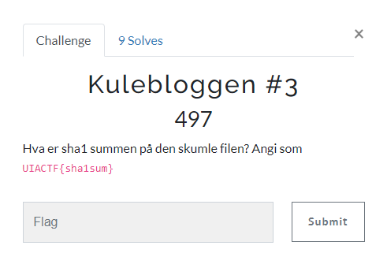
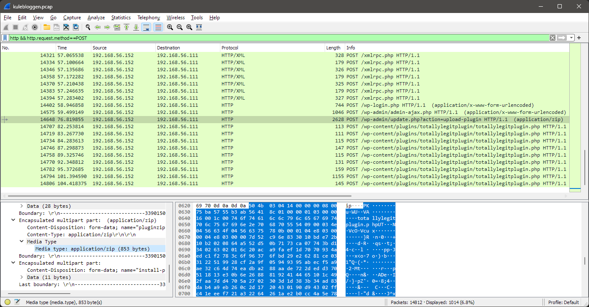
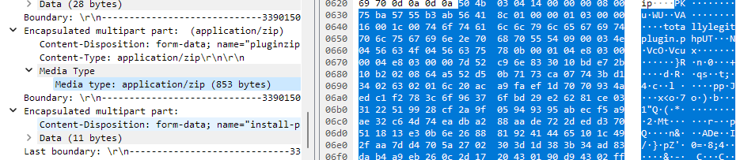
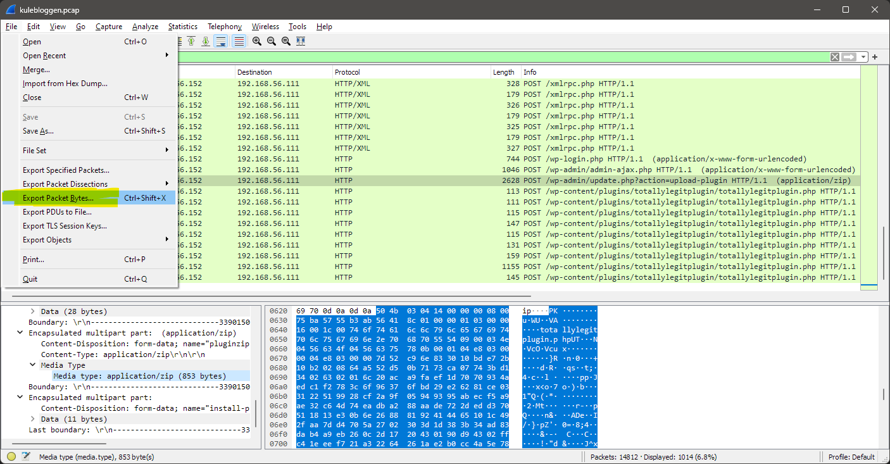

# Kulebloggen #3

> Kulebloggen #3
>
> Hva er sha1 summen på den skumle filen?
>
> Angi som UIACTF{sha1sum}



---

Vi ser en request til `POST /wp-admin/update.php?action=upload-plugin`. Her lastes det opp en plugin.



Vi driller oss ned requesten og finner den spesifikke delen av requesten som inneholder selve filen:



Denne kan vi enkelt eksportere fra `File -> Export Packet Bytes`:



Vi ser at filen er en `ZIP`-fil som forventet og vi kan enkelt kalkulere `SHA-1`-hashen:

```bash
$ file pluginzip.bin
pluginzip.bin: Zip archive data, at least v2.0 to extract, compression method=deflate

$ sha1sum pluginzip.bin
7b4c6e336d988c2151f12e40e4ae8c6d1464c014  pluginzip.bin
```

## Flagg

Flagget blir da:

`UIACTF{7b4c6e336d988c2151f12e40e4ae8c6d1464c014}`
