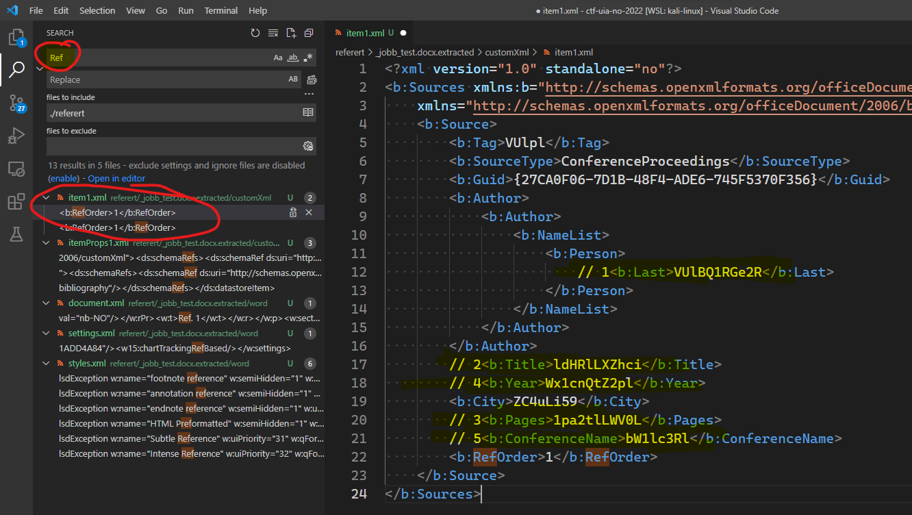

# Referert

```bash
$ ole
ole32.dll        oleacchooks.dll  oleaut32.dll     oledir           olefile          olemap           oleobj           oletimes
oleacc.dll       oleaccrc.dll     olebrowse        oledlg.dll       oleid            olemeta          oleprn.dll       olevba
$ olevba jobb_test.docx
olevba 0.60.1 on Python 3.10.5 - http://decalage.info/python/oletools
===============================================================================
FILE: jobb_test.docx
Type: OpenXML
No VBA or XLM macros found.


$ binwalk jobb_test.docx

DECIMAL       HEXADECIMAL     DESCRIPTION
--------------------------------------------------------------------------------
0             0x0             Zip archive data, at least v2.0 to extract, compressed size: 394, uncompressed size: 1833, name: [Content_Types].xml
963           0x3C3           Zip archive data, at least v2.0 to extract, compressed size: 254, uncompressed size: 737, name: _rels/.rels
1778          0x6F2           Zip archive data, at least v2.0 to extract, compressed size: 774, uncompressed size: 2975, name: word/document.xml
2599          0xA27           Zip archive data, at least v2.0 to extract, compressed size: 291, uncompressed size: 1223, name: word/_rels/document.xml.rels
3212          0xC8C           Zip archive data, at least v2.0 to extract, compressed size: 707, uncompressed size: 3021, name: word/footnotes.xml
3967          0xF7F           Zip archive data, at least v2.0 to extract, compressed size: 705, uncompressed size: 3015, name: word/endnotes.xml
4719          0x126F          Zip archive data, at least v2.0 to extract, compressed size: 1750, uncompressed size: 8392, name: word/theme/theme1.xml
6520          0x1978          Zip archive data, at least v2.0 to extract, compressed size: 1177, uncompressed size: 3559, name: word/settings.xml
7744          0x1E40          Zip archive data, at least v2.0 to extract, compressed size: 408, uncompressed size: 735, name: customXml/item1.xml
8241          0x2031          Zip archive data, at least v2.0 to extract, compressed size: 226, uncompressed size: 341, name: customXml/itemProps1.xml
8561          0x2171          Zip archive data, at least v2.0 to extract, compressed size: 3183, uncompressed size: 30746, name: word/styles.xml
11789         0x2E0D          Zip archive data, at least v2.0 to extract, compressed size: 450, uncompressed size: 1310, name: word/webSettings.xml
12289         0x3001          Zip archive data, at least v2.0 to extract, compressed size: 495, uncompressed size: 1658, name: word/fontTable.xml
12832         0x3220          Zip archive data, at least v2.0 to extract, compressed size: 354, uncompressed size: 727, name: docProps/core.xml
13497         0x34B9          Zip archive data, at least v2.0 to extract, compressed size: 363, uncompressed size: 709, name: docProps/app.xml
14170         0x375A          Zip archive data, at least v2.0 to extract, compressed size: 438, uncompressed size: 1517, name: docProps/custom.xml
14921         0x3A49          Zip archive data, at least v2.0 to extract, compressed size: 194, uncompressed size: 296, name: customXml/_rels/item1.xml.rels
16547         0x40A3          End of Zip archive, footer length: 22


$ binwalk -e jobb_test.docx

DECIMAL       HEXADECIMAL     DESCRIPTION
--------------------------------------------------------------------------------
0             0x0             Zip archive data, at least v2.0 to extract, compressed size: 394, uncompressed size: 1833, name: [Content_Types].xml
963           0x3C3           Zip archive data, at least v2.0 to extract, compressed size: 254, uncompressed size: 737, name: _rels/.rels
1778          0x6F2           Zip archive data, at least v2.0 to extract, compressed size: 774, uncompressed size: 2975, name: word/document.xml
2599          0xA27           Zip archive data, at least v2.0 to extract, compressed size: 291, uncompressed size: 1223, name: word/_rels/document.xml.rels
3212          0xC8C           Zip archive data, at least v2.0 to extract, compressed size: 707, uncompressed size: 3021, name: word/footnotes.xml
3967          0xF7F           Zip archive data, at least v2.0 to extract, compressed size: 705, uncompressed size: 3015, name: word/endnotes.xml
4719          0x126F          Zip archive data, at least v2.0 to extract, compressed size: 1750, uncompressed size: 8392, name: word/theme/theme1.xml
6520          0x1978          Zip archive data, at least v2.0 to extract, compressed size: 1177, uncompressed size: 3559, name: word/settings.xml
7744          0x1E40          Zip archive data, at least v2.0 to extract, compressed size: 408, uncompressed size: 735, name: customXml/item1.xml
8241          0x2031          Zip archive data, at least v2.0 to extract, compressed size: 226, uncompressed size: 341, name: customXml/itemProps1.xml
8561          0x2171          Zip archive data, at least v2.0 to extract, compressed size: 3183, uncompressed size: 30746, name: word/styles.xml
11789         0x2E0D          Zip archive data, at least v2.0 to extract, compressed size: 450, uncompressed size: 1310, name: word/webSettings.xml
12289         0x3001          Zip archive data, at least v2.0 to extract, compressed size: 495, uncompressed size: 1658, name: word/fontTable.xml
12832         0x3220          Zip archive data, at least v2.0 to extract, compressed size: 354, uncompressed size: 727, name: docProps/core.xml
13497         0x34B9          Zip archive data, at least v2.0 to extract, compressed size: 363, uncompressed size: 709, name: docProps/app.xml
14170         0x375A          Zip archive data, at least v2.0 to extract, compressed size: 438, uncompressed size: 1517, name: docProps/custom.xml
14921         0x3A49          Zip archive data, at least v2.0 to extract, compressed size: 194, uncompressed size: 296, name: customXml/_rels/item1.xml.rels
16547         0x40A3          End of Zip archive, footer length: 22

$ ll
total 24
-rw-r--r-- 1 hag hag 16569 Oct 26 13:31 jobb_test.docx
drwxr-xr-x 6 hag hag  4096 Oct 26 13:34 _jobb_test.docx.extracted
```

La oss bare søke gjennom alt som ble `extract`'et med `binwalk`:



Her er det noen datafragmenter som ser ut som `base64`-data. Etter å ha funnet riktig rekkefølge for sammenslåing ble dataen slik:

```bash
$ echo -n "VUlBQ1RGe2RldHRlLXZhci1pa2tlLWV0LWx1cnQtZ2plbW1lc3RlZC4uLi59" | base64 -d
UIACTF{dette-var-ikke-et-lurt-gjemmested....}
```

## Flagg

`UIACTF{dette-var-ikke-et-lurt-gjemmested....}`
