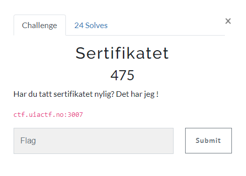

# Sertifikatet

> Sertifikatet
>
> Har du tatt sertifikatet nylig? Det har jeg !
>
> ctf.uiactf.no:3007

---

Når vi besøker nettsiden får vi beskjed om å benytte `HTTPS`.

Etter bytte til `HTTPS` ser vi et bilde som beskriver en sertifikatfeil og hinter også til "View Certificate".

La oss se nærmere på sertifikatet i nettleseren:

Der var flagget vårt gitt!

## Flagg
`uiactf{god-sikkerhet-paa-plass}`
