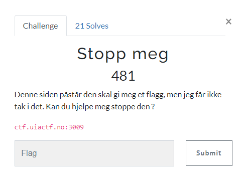
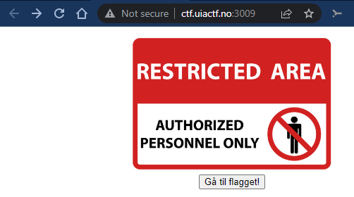
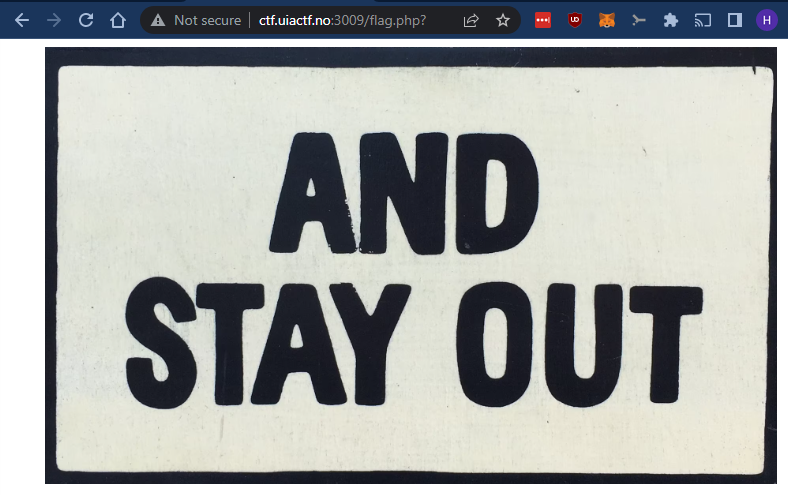
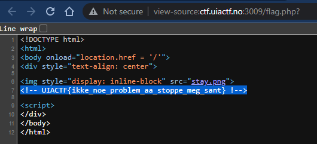

# Stopp meg

> Stopp meg
>
> Denne siden påstår den skal gi meg et flagg, men jeg får ikke tak i det. Kan du hjelpe meg stoppe den ?
>
> ctf.uiactf.no:3009

---

Nettsiden viser et bilde som sier "Restricted Area", men tilbyr alikevel å sende oss videre til flagget... 🤷🏻‍♂️

Der ble vi møtt med et nytt bilde; "And Stay Out"!

Ikke så mye å gjøre på denne siden, la oss se på kildekoden:

Der ligger flagget i en `HTML`-kommentar.

## Flagg
`UIACTF{ikke_noe_problem_aa_stoppe_meg_sant}`
