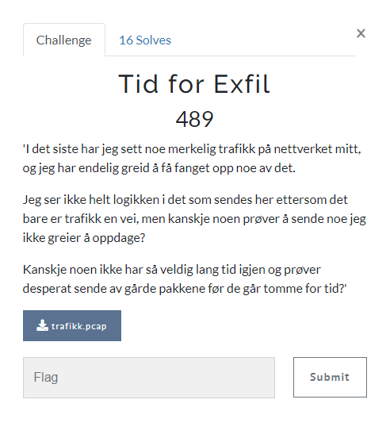

# Tid for Exfil

> Tid for Exfil
>
> I det siste har jeg sett noe merkelig trafikk på nettverket mitt, og jeg har endelig greid å få fanget opp noe av det.
>
> Jeg ser ikke helt logikken i det som sendes her ettersom det bare er trafikk en vei, men kanskje noen prøver å sende noe jeg ikke greier å oppdage?
>
> Kanskje noen ikke har så veldig lang tid igjen og prøver desperat sende av gårde pakkene før de går tomme for tid?
>
> File: `trafikk.pcap`



---

La oss ta en titt på `trafikk.pcap`:

```bash
$ file trafikk.pcap
trafikk.pcap: pcap capture file, microsecond ts (little-endian) - version 2.4 (Ethernet, capture length 262144)
```

Som forventet av filnavnet og `.pcap`-filtypen er dette en capture-fil med nettverkstrafikk. Vi kan åpne den i Wireshark f.eks.:


Trafikken i denne filen er litt vanskelig å skjønne så mye av ved hjelp av Wireshark, follow TCP stream fungerer ikke pga. formatet på pakkene. Men vi ser at det bare er noen få bytes som endrer seg i hver pakke. Når jeg blar nedover ser jeg også at `byte`'en i `TTL`-feltet faller innenfor `ASCII`-området og jeg ser at det ser ut som om hver pakke inneholder én karakter.

Det er nok en måte å eksportere `TTL`-feltet fra hver pakke i Wireshark eller eventuelt en måte å skripte det på, men la oss forflytte oss til terminalen istedet:

```bash
$ tcpdump -qns 0 -X -r trafikk.pcap
reading from file trafikk.pcap, link-type EN10MB (Ethernet), snapshot length 262144
# abbreviated...
19:22:44.201445 IP 10.10.10.2.0 > 10.10.10.1.80: tcp 0
        0x0000:  4500 0028 0001 0000 6806 2ab9 0a0a 0a02  E..(....h.*.....
        0x0010:  0a0a 0a01 0000 0050 0000 0000 0000 0000  .......P........
        0x0020:  5002 2000 677c 0000                      P...g|..
19:22:44.280106 IP 10.10.10.2.0 > 10.10.10.1.80: tcp 0
        0x0000:  4500 0028 0001 0000 6106 31b9 0a0a 0a02  E..(....a.1.....
        0x0010:  0a0a 0a01 0000 0050 0000 0000 0000 0000  .......P........
        0x0020:  5002 2000 677c 0000                      P...g|..
19:22:44.361815 IP 10.10.10.2.0 > 10.10.10.1.80: tcp 0
        0x0000:  4500 0028 0001 0000 6c06 26b9 0a0a 0a02  E..(....l.&.....
        0x0010:  0a0a 0a01 0000 0050 0000 0000 0000 0000  .......P........
        0x0020:  5002 2000 677c 0000                      P...g|..
19:22:44.440865 IP 10.10.10.2.0 > 10.10.10.1.80: tcp 0
        0x0000:  4500 0028 0001 0000 6c06 26b9 0a0a 0a02  E..(....l.&.....
        0x0010:  0a0a 0a01 0000 0050 0000 0000 0000 0000  .......P........
        0x0020:  5002 2000 677c 0000                      P...g|..
19:22:44.521265 IP 10.10.10.2.0 > 10.10.10.1.80: tcp 0
        0x0000:  4500 0028 0001 0000 6f06 23b9 0a0a 0a02  E..(....o.#.....
        0x0010:  0a0a 0a01 0000 0050 0000 0000 0000 0000  .......P........
        0x0020:  5002 2000 677c 0000                      P...g|..
# abbreviated...
```

Her kan vi se at byte 9 i hver pakke endrer seg og utgjør ordet `hallo`. Dersom vi piper til `grep 0x0000` blir det lettere å se:

```bash
$ tcpdump -qns 0 -X -r trafikk.pcap | grep 0x0000
reading from file trafikk.pcap, link-type EN10MB (Ethernet), snapshot length 262144
# abbreviated...
        0x0000:  4500 0028 0001 0000 6806 2ab9 0a0a 0a02  E..(....h.*.....
        0x0000:  4500 0028 0001 0000 6106 31b9 0a0a 0a02  E..(....a.1.....
        0x0000:  4500 0028 0001 0000 6c06 26b9 0a0a 0a02  E..(....l.&.....
        0x0000:  4500 0028 0001 0000 6c06 26b9 0a0a 0a02  E..(....l.&.....
        0x0000:  4500 0028 0001 0000 6f06 23b9 0a0a 0a02  E..(....o.#.....
# abbreviated...
```

Og enda lettere:

```bash
$ tcpdump -qns 0 -X -r trafikk.pcap | grep 0x0000 | cut -b 60
reading from file trafikk.pcap, link-type EN10MB (Ethernet), snapshot length 262144
# abbreviated...
h
a
l
l
o
# abbreviated...
```

... og med enda litt mer diverse tools som jeg ikke kan bruke skikkelig:

```bash
$ tcpdump -qns 0 -X -r trafikk.pcap | grep 0x0000 | cut -b 60 | tr -d '\n' | sed 's/\./\ /g'
reading from file trafikk.pcap, link-type EN10MB (Ethernet), snapshot length 262144
Hei hallo, h per du har det bra! Jeg har kommet meg inn i nettet til denne karen n  og h per jeg f r sendt ut noe data slik at vi f r noe verdi av dette  Meldingen jeg har snappet opp internt til n  er: uiactf{topp_hemmelig_info_sendt_over_TTL}   Motatt? ? Nei? Hm, hvordan f r jeg noe svar her da tru  Kanskje ikke ha sourceport 0 hjelper kanskje
```

Der har vi lesbar kommunikasjon som ble eksfiltrert over nettverket og vi finner flagget vårt.


## Flag

`uiactf{topp_hemmelig_info_sendt_over_TTL}`
